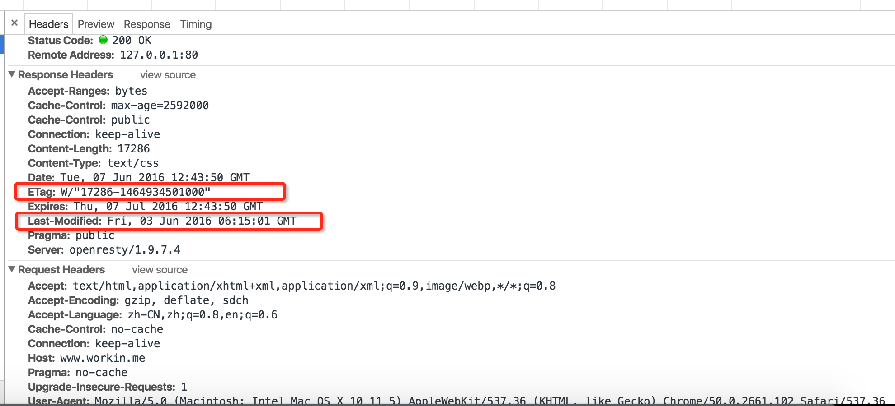
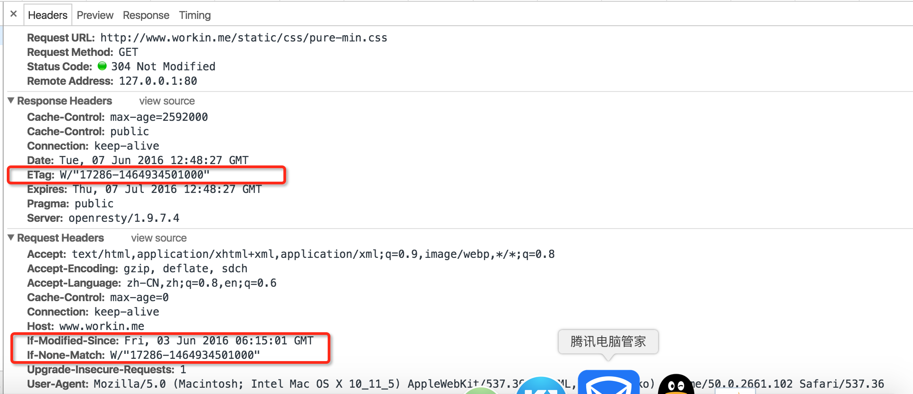
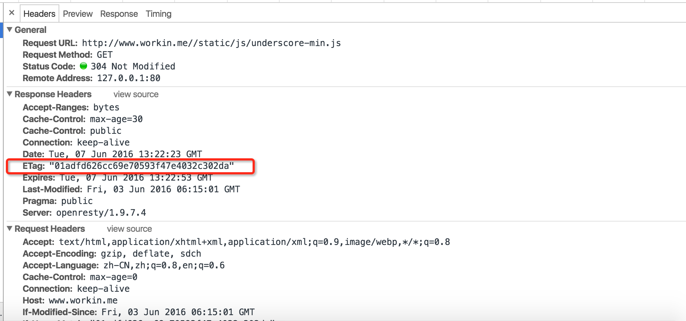
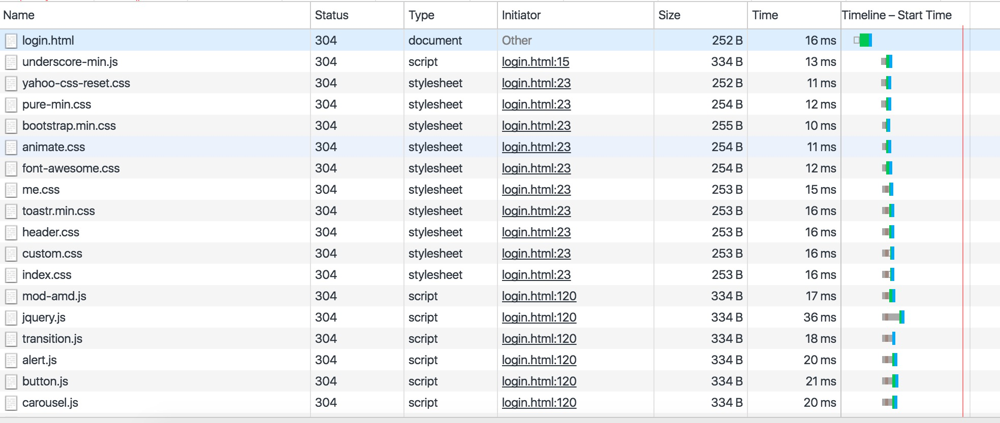
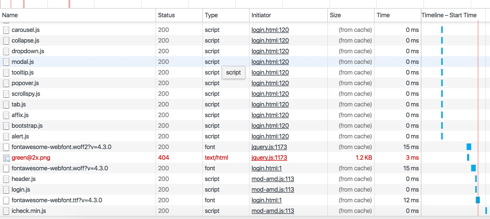
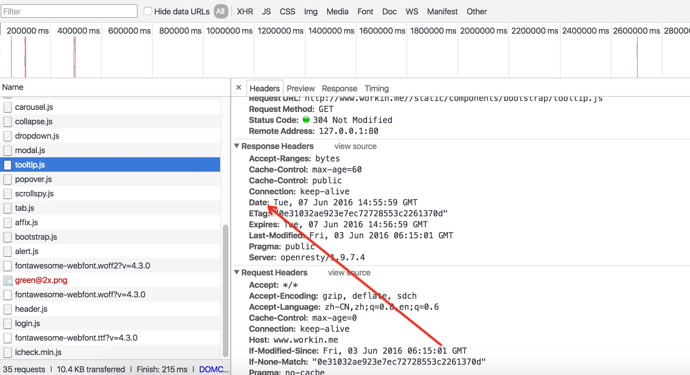
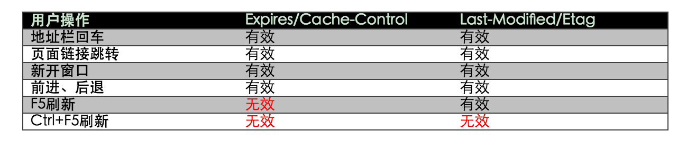
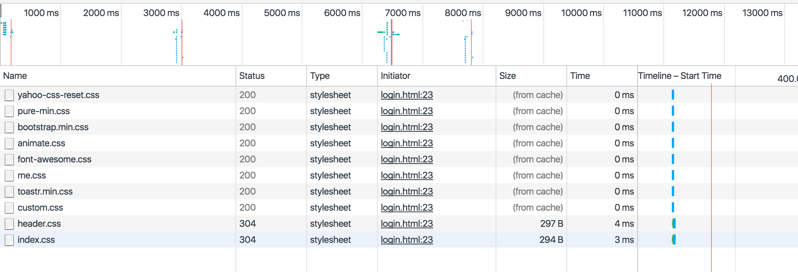
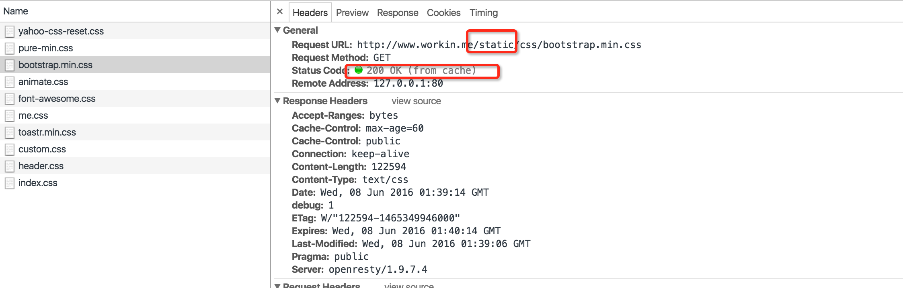
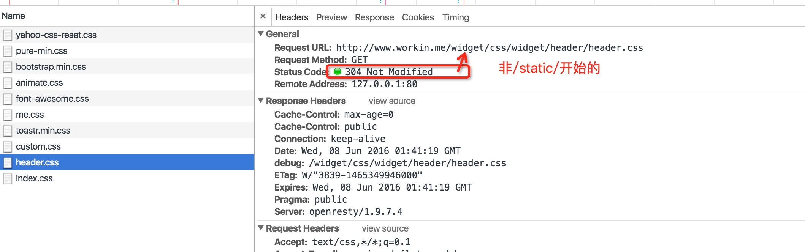

# 浏览器缓存 #
## 目的 ##
1. 提高前端的响应速度
1. 降低服务器带宽，磁盘IO压力

## 304 协商缓存 ##
 1. 这种方式主要是通过：ETag/If-None-Match or If-Modified-Since/Last-Modified这两对头进行控制，
这两种方式协同工作，ETag 是对文件的一种签名，不同的服务器有不同的实现，也可以程序内部自己实现，如md5,sha1等。
If-Modified-Since是文件修改时间为依据
   1. 浏览器第一次访问，下行的头信息中会有：Last-modified、ETag的描述，这时浏览器会对这两个信息进行缓存
   
   1. 再次访问的时候，浏览器会通过：If-None-Match、If-Modified-Since这两个请求头，把刚才的信息带到服务器去，服务器决定是否需要返回资源的内容（200、304）
   
 1. 在集群环境中使会遇到两个问题：
   1. 集群部署，不可能每台服务器更新文件的时间都是一样的，总会有先有会先后，这样除非用粘性路由这种方式，让这个用户的每次请求都落在同一个节点上，
否则到另一台服务器校验的时候，客户端的If-Modified-Since时间和服务器上的时间肯定是不一样的，那这次访问状态就会是200了。这个时候大家就会想起
ETag了
   1. 其实即使使用ETag，在集群环境中也会有问题的，因为同一个文件（shell中可以对文件使用sha1sum，md5sum获得文件签名结果比较）
在不同的服务器上返回的ETag有可能是不一样的，至少tomcat集群中是这样的。
> ETag: W/"13397-1184876416000" 这是一个由tomcat生成 ETag 13397表示文件大小 1184876416000表示文件最后修改时间（精确毫秒）
前面我们已经讨论过集群中文件修改时间的问题了,因此为了解决这个问题我们需要自己实现 ETag，

      具体参考 org.springframework.web.filter.ShallowEtagHeaderFilter
      ``` java
      package org.springframework.web.filter;

      import java.io.IOException;
      import javax.servlet.FilterChain;
      import javax.servlet.ServletException;
      import javax.servlet.http.HttpServletRequest;
      import javax.servlet.http.HttpServletResponse;

      import org.springframework.http.HttpMethod;
      import org.springframework.util.Assert;
      import org.springframework.util.ClassUtils;
      import org.springframework.util.DigestUtils;
      import org.springframework.util.StreamUtils;
      import org.springframework.web.util.ContentCachingResponseWrapper;
      import org.springframework.web.util.WebUtils;

      public class ShallowEtagHeaderFilter extends OncePerRequestFilter {

      	private static final String HEADER_ETAG = "ETag";

      	private static final String HEADER_IF_NONE_MATCH = "If-None-Match";

      	private static final String HEADER_CACHE_CONTROL = "Cache-Control";

      	private static final String DIRECTIVE_NO_STORE = "no-store";

      	private static final boolean responseGetHeaderAvailable =
      			ClassUtils.hasMethod(HttpServletResponse.class, "getHeader", String.class);

      	@Override
      	protected boolean shouldNotFilterAsyncDispatch() {
      		return false;
      	}

      	@Override
      	protected void doFilterInternal(HttpServletRequest request, HttpServletResponse response, FilterChain filterChain)
      			throws ServletException, IOException {

      		HttpServletResponse responseToUse = response;
      		if (!isAsyncDispatch(request) && !(response instanceof ContentCachingResponseWrapper)) {
      			responseToUse = new ContentCachingResponseWrapper(response);
      		}

      		filterChain.doFilter(request, responseToUse);

      		if (!isAsyncStarted(request)) {
      			updateResponse(request, responseToUse);
      		}
      	}

      	private void updateResponse(HttpServletRequest request, HttpServletResponse response) throws IOException {
      		ContentCachingResponseWrapper responseWrapper =
      				WebUtils.getNativeResponse(response, ContentCachingResponseWrapper.class);
      		Assert.notNull(responseWrapper, "ShallowEtagResponseWrapper not found");

      		HttpServletResponse rawResponse = (HttpServletResponse) responseWrapper.getResponse();
      		int statusCode = responseWrapper.getStatusCode();
      		byte[] body = responseWrapper.getContentAsByteArray();

      		if (rawResponse.isCommitted()) {
      			if (body.length > 0) {
      				StreamUtils.copy(body, rawResponse.getOutputStream());
      			}
      		}
      		else if (isEligibleForEtag(request, responseWrapper, statusCode, body)) {
      			String responseETag = generateETagHeaderValue(body);
      			rawResponse.setHeader(HEADER_ETAG, responseETag);
      			String requestETag = request.getHeader(HEADER_IF_NONE_MATCH);
      			if (responseETag.equals(requestETag)) {
      				if (logger.isTraceEnabled()) {
      					logger.trace("ETag [" + responseETag + "] equal to If-None-Match, sending 304");
      				}
      				rawResponse.setStatus(HttpServletResponse.SC_NOT_MODIFIED);
      			}
      			else {
      				if (logger.isTraceEnabled()) {
      					logger.trace("ETag [" + responseETag + "] not equal to If-None-Match [" + requestETag +
      							"], sending normal response");
      				}
      				if (body.length > 0) {
      					rawResponse.setContentLength(body.length);
      					StreamUtils.copy(body, rawResponse.getOutputStream());
      				}
      			}
      		}
      		else {
      			if (logger.isTraceEnabled()) {
      				logger.trace("Response with status code [" + statusCode + "] not eligible for ETag");
      			}
      			if (body.length > 0) {
      				rawResponse.setContentLength(body.length);
      				StreamUtils.copy(body, rawResponse.getOutputStream());
      			}
      		}
      	}

      	protected boolean isEligibleForEtag(HttpServletRequest request, HttpServletResponse response,
      			int responseStatusCode, byte[] responseBody) {

      		if (responseStatusCode >= 200 && responseStatusCode < 300 &&
      				HttpMethod.GET.name().equals(request.getMethod())) {
      			String cacheControl = (responseGetHeaderAvailable ? response.getHeader(HEADER_CACHE_CONTROL) : null);
      			if (cacheControl == null || !cacheControl.contains(DIRECTIVE_NO_STORE)) {
      				return true;
      			}
      		}
      		return false;
      	}

      	protected String generateETagHeaderValue(byte[] bytes) {
      		StringBuilder builder = new StringBuilder("\"0");
      		DigestUtils.appendMd5DigestAsHex(bytes, builder);
      		builder.append('"');
      		return builder.toString();
      	}

      }
      ```

      web.xml
      ``` xml
          <filter>
              <filter-name>etagFilter</filter-name>
              <filter-class>org.springframework.web.filter.ShallowEtagHeaderFilter</filter-class>
          </filter>
          <filter-mapping>
              <filter-name>etagFilter</filter-name>
              <url-pattern>*.js</url-pattern>
          </filter-mapping>
          <filter-mapping>
              <filter-name>etagFilter</filter-name>
              <url-pattern>*.css</url-pattern>
          </filter-mapping>
          <filter-mapping>
              <filter-name>etagFilter</filter-name>
              <url-pattern>*.jpg</url-pattern>
          </filter-mapping>
          <filter-mapping>
              <filter-name>etagFilter</filter-name>
              <url-pattern>*.jpeg</url-pattern>
          </filter-mapping>
          <filter-mapping>
              <filter-name>etagFilter</filter-name>
              <url-pattern>*.bmp</url-pattern>
          </filter-mapping>
          <filter-mapping>
              <filter-name>etagFilter</filter-name>
              <url-pattern>*.png</url-pattern>
          </filter-mapping>
          <filter-mapping>
              <filter-name>etagFilter</filter-name>
              <url-pattern>*.gif</url-pattern>
          </filter-mapping>
          <filter-mapping>
              <filter-name>etagFilter</filter-name>
              <url-pattern>*.tpl</url-pattern>
          </filter-mapping>
          <filter-mapping>
              <filter-name>etagFilter</filter-name>
              <url-pattern>*.html</url-pattern>
          </filter-mapping>
      ```
  修改后的md5效果
  

## 200 from cache 强缓存 ##
  1. 什么情况下会触发200 from cache？
    如果满足上面的304的条件，在浏览器里刷新页面会是304，浏览器地址直接回车就会是200 from cache

  浏览器刷新
  
  直接地址栏回车，可以对比上图看到每个请求节约一次联网的时间，304省掉的只是内容数据返回的网络时间
  
  1. 还会有其它的限制条件么？
    试试修改Cache-Control的时间为30s,过30s后在地址栏上回车，结果全部变成了304，所以它还受Cache-Control/Expires影响,
  Cache-Control上的时间60s,Date上的时间是系统当前时间，Expires时间就是Date+Cache-Control中的max-age时间，
  如下图中所示：因为过期了，所以即使回车也是304
  
  1. 用户行为和缓存的关系
  

## 几个相关的头信息的作用及优先级 ##
  1. #### Cache-Control/Expires ####
    Cache-Control与Expires的作用一致，都是指明当前资源的有效期，控制浏览器是否直接从浏览器缓存取数据还是重新发请求到服务器取数据。
    只不过Cache-Control的选择更多，设置更细致，如果同时设置的话，其优先级高于Expires
      http协议头Cache-Control值可以是public、private、no-cache、no- store、no-transform、must-revalidate、proxy-revalidate、
      max-age各个消息中的指令含义如下：
  >  
    - Public指示响应可被任何缓存区缓存。
    - Private指示对于单个用户的整个或部分响应消息，不能被共享缓存处理。这允许服务器仅仅描述当用户的部分响应消息，此响应消息对于其他用户的请求无效。
    - no-cache指示请求或响应消息不能缓存
    - no-store用于防止重要的信息被无意的发布。在请求消息中发送将使得请求和响应消息都不使用缓存。
    - max-age指示客户机可以接收生存期不大于指定时间（以秒为单位）的响应。
    - min-fresh指示客户机可以接收响应时间小于当前时间加上指定时间的响应。
    - max-stale指示客户机可以接收超出超时期间的响应消息。如果指定max-stale消息的值，那么客户机可以接收超出超时期指定值之内的响应消息。
    * 另外有一点需要注意的是：expire时间并不是一定要等于Cache-Control中的max-age + Date

  1. #### ETag/If-None-Match ####
    在Cache-Control作用的前提下，接下来就看ETag这个标签，前面已经提过tomcat的ETag生成原理及我们如何自己实现Etag解决集群中的问题，
    说白了Etag就是一个标识文件内容的摘要信息，用来表示这个文件是否有修改过。
  1. #### Last-modified/If-Modified-Since ####
    Last-modified是在满足Cache-Control且Etag未提交的情况下（即request header中没有If-None-Match信息），才会使用。
  1. #### 既生Last-Modified何生Etag？ ####
    - 群集部署时没办法保证文件在所有服务器上的创建时间是一样的
    - Last-Modified标注的最后修改只能精确到秒级，如果某些文件在1秒钟以内，被修改多次的话，它将不能准确标注文件的修改时间
    - 如果某些文件会被定期生成，当有时内容并没有任何变化，但Last-Modified却改变了，导致文件没法使用缓存
    - 有可能存在服务器没有准确获取文件修改时间，或者与代理服务器时间不一致等情形

  Etag是服务器自动生成或者由开发者生成的对应资源在服务器端的唯一标识符，能够更加准确的控制缓存。Last-Modified与ETag是可以一起使用的，服务器会优先验证ETag，一致的情况下，才会继续比对Last-Modified，最后才决定是否返回304。

## 整体流程 ##
  请求的整体流程图如下：

  * 首次请求

  

  * 再次请求

  

## 如何充分利用缓存 ##
  目前已经知道缓存有两种可能：一种是服务器大包大揽（200 from cache），浏览器这个时间点之内不要来烦我了。另一种是服务器和浏览器协商，
  浏览器告诉服务器自己本地的已有信息（If-None-Match,If-Modified-Since），服务器再和自己的文件比较决定是否要返回文件内容


  我们的服务器上的资源通常包括以下几种：
  1. 一些静态文件（js/css/image/html）
    - 经常变化的：程序员自己开发用的html,css,js等
    - 基本上不会变化的： 依赖的jquery，tree等，相信大多数时候你不会不断的去修改这些源码吧
  2. 一些由程序动态输出的结果


  所以我们可以集合自己的业务做一个这样的规划：

  1. 假设我们是完全的前后端分离，数据前端ajax后渲染，协议是以json进行交互，所以的协议url以/api开始,这部分数据不缓存
  ```xml
    <filter>
    <filter-name>encodingFilter</filter-name>
    <filter-class>org.springframework.web.filter.CharacterEncodingFilter</filter-class>
    <async-supported>true</async-supported>
    <init-param>
      <param-name>encoding</param-name>
      <param-value>utf-8</param-value>
    </init-param>
    </filter>
    <filter-mapping>
    <filter-name>encodingFilter</filter-name>
      <url-pattern>/api/*</url-pattern>
    </filter-mapping>
  ```
  1. 我们认为长期不变的文件都放在以/static/目录下面，对这部分文件使用200 from cache 进行缓存
  1. 剩下的html,css,image进行304缓存，每次都需要浏览器和服务器确认

  根据上面的规划在nginx中的配置
  ```
  server{
        listen       80;
        server_name www.workin.me workin.me;
        charset utf-8;

        rewrite  ^/(.*)$ /apps-web/$1 last;
        location ^~ /api/ {
            access_by_lua '
                local request = require "resty.rate.limit"
                request.limit { key = ngx.var.remote_addr,
                                rate = 60,
                                interval = 60,
                                log_level = ngx.NOTICE,
                                redis_config = { host = "127.0.0.1", port = 6379, timeout = 1, pool_size = 100 } }
            ';
            proxy_pass         http://tomcat;
            proxy_redirect     off;
            proxy_cookie_path   /apps-web/ "/";

            proxy_set_header   Host             $host;
            proxy_set_header   X-Real-IP        $remote_addr;
            proxy_set_header   X-Forwarded-For  $proxy_add_x_forwarded_for;
            proxy_set_header   Cookie $http_cookie;

            client_body_buffer_size    128k;

            proxy_connect_timeout      300;
            #proxy_send_timeout         300;
            proxy_read_timeout         300;

            proxy_buffer_size          4k;
            proxy_buffers              4 32k;
            proxy_busy_buffers_size    64k;
            proxy_temp_file_write_size 64k;
        }

        location ^~ /apps-web/static/ {
                expires 60s; #设置为60,60s以内别再请求
                add_header debug 1;
                add_header Pragma public;
                add_header Cache-Control "public";
                proxy_pass         http://tomcat;
                proxy_redirect     off;

                proxy_set_header   Host             $host;
                proxy_set_header   X-Real-IP        $remote_addr;
                proxy_set_header   X-Forwarded-For  $proxy_add_x_forwarded_for;

                client_body_buffer_size    128k;

                proxy_connect_timeout      300;
                #proxy_send_timeout         300;
                proxy_read_timeout         300;

                proxy_buffer_size          4k;
                proxy_buffers              4 32k;
                proxy_busy_buffers_size    64k;
                proxy_temp_file_write_size 64k;
        }

        location ~* \.(?:ico|css|js|gif|jpeg|png)$ {
                expires 0s; #设置为0每次都协商
                add_header debug $request_uri;
                add_header Pragma public;
                add_header Cache-Control "public";
                proxy_pass         http://tomcat;
                proxy_redirect     off;

                proxy_set_header   Host             $host;
                proxy_set_header   X-Real-IP        $remote_addr;
                proxy_set_header   X-Forwarded-For  $proxy_add_x_forwarded_for;

                client_body_buffer_size    128k;

                proxy_connect_timeout      300;
                #proxy_send_timeout         300;
                proxy_read_timeout         300;

                proxy_buffer_size          4k;
                proxy_buffers              4 32k;
                proxy_busy_buffers_size    64k;
                proxy_temp_file_write_size 64k;
        }

        # Main
        # rewrite  ^/(.*)$ /apps-web/$1 last;
        location / {
            expires 0s; #设置为0每次都协商
            proxy_pass         http://tomcat/;
            proxy_redirect     off;
            proxy_cookie_path   /apps-web/ "/";

            proxy_set_header   Host             $host;
            proxy_set_header   X-Real-IP        $remote_addr;
            proxy_set_header   X-Forwarded-For  $proxy_add_x_forwarded_for;
            proxy_set_header   Cookie $http_cookie;

            client_body_buffer_size    128k;

            proxy_connect_timeout      300;
            #proxy_send_timeout         300;
            proxy_read_timeout         300;

            proxy_buffer_size          4k;
            proxy_buffers              4 32k;
            proxy_busy_buffers_size    64k;
            proxy_temp_file_write_size 64k;
        }
    }
  ```
  测试结果
    可以看出，部分请求是200 from cache，部分是304
    
    可以看出这个200 from cache跟我们的预想是一样的/static/* 这样的路径
    
    这个是我们经常开发用的文件，所以用304的方式，满足经常修改的需要
    
