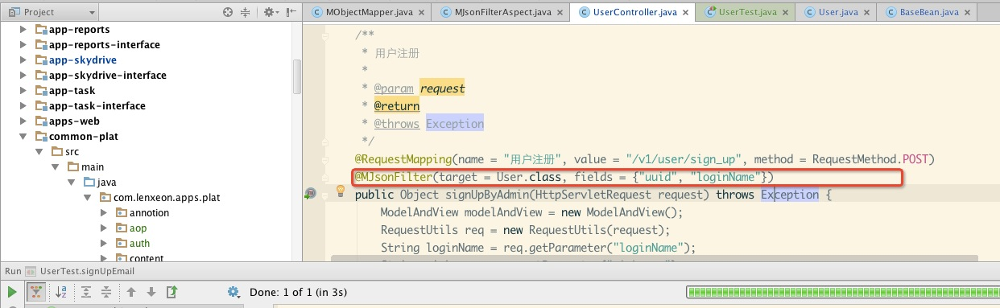
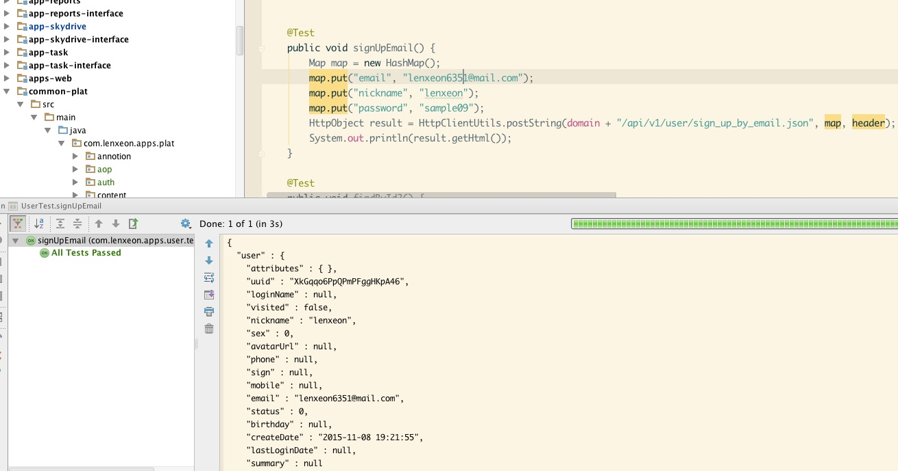
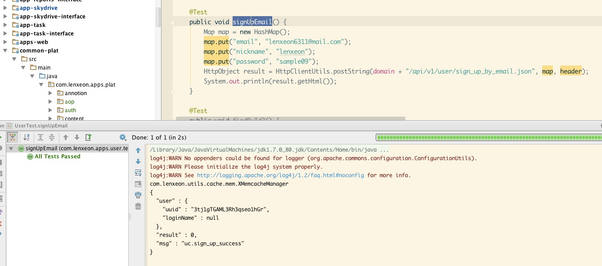

#jackson同一实体在不同的场景下指定输出不同的字段


## 场景

我们经常会遇上这样的情况，比如有一个User实体对象，大大小小一共起码得有十几个字段，然后有一个Resource实体
对象，Resource上有一个属性是creator，类型是User。在用户注册，登陆，获取用户详情的时候这个用户对象的数据完全
输出到协议中，但在获取资源详情的时候我们并不关注用户的全部信息，而实际关注的大概也就是：用户（id, 呢称，头像）

这时底层有两种做法:

1. 用户表的这三个字段和资源表外链，在dao中一次性完成creator对象的三个属性映射
1. 先查资源对象，再查用户信息，这种方式在缓存做的比较好的时候性能并不会损耗多少

但无论采用上面哪种方式，输出到结果中时，用户对象中除了我们期望的（id, 呢称，头像）外
其它的属性依然会输出，会令我们的协议看起来不那么完美，也浪费了网络资源，因为追求完美，
所以我们要想办法实现我们的想法，在不同的场景下，我们需要对实体的输出字段进行量身定制。


我们先看看用户对象和它的父对象。
```java
package com.lenxeon.apps.user.pojo;

import com.fasterxml.jackson.annotation.JsonFilter;
import com.fasterxml.jackson.annotation.JsonIgnore;
import com.lenxeon.apps.plat.pojo.BaseBean;

import java.util.Date;

public class User extends BaseBean {

    protected String uuid;

    protected String loginName;

    private Boolean visited;

    protected String nickname;

    @JsonIgnore
    private String password;

    protected Integer sex;

    protected String avatarUrl;

    private String phone;

    private String sign;

    private String mobile;

    private String email;

    private Integer status;

    private Date birthday;

    private Date createDate;

    private Date lastLoginDate;

    private String summary;


    public String getUuid() {
        return uuid;
    }

    public void setUuid(String uuid) {
        this.uuid = uuid;
    }

    public String getLoginName() {
        return loginName;
    }

    public void setLoginName(String loginName) {
        this.loginName = loginName;
    }

    public Boolean getVisited() {
        return visited;
    }

    public void setVisited(Boolean visited) {
        this.visited = visited;
    }

    public String getNickname() {
        return nickname;
    }

    public void setNickname(String nickname) {
        this.nickname = nickname;
    }

    public String getPassword() {
        return password;
    }

    public void setPassword(String password) {
        this.password = password;
    }

    public Integer getSex() {
        return sex;
    }

    public void setSex(Integer sex) {
        this.sex = sex;
    }

    public String getAvatarUrl() {
        return avatarUrl;
    }

    public void setAvatarUrl(String avatarUrl) {
        this.avatarUrl = avatarUrl;
    }

    public String getPhone() {
        return phone;
    }

    public void setPhone(String phone) {
        this.phone = phone;
    }

    public String getMobile() {
        return mobile;
    }

    public void setMobile(String mobile) {
        this.mobile = mobile;
    }

    public String getEmail() {
        return email;
    }

    public void setEmail(String email) {
        this.email = email;
    }

    public Integer getStatus() {
        return status;
    }

    public void setStatus(Integer status) {
        this.status = status;
    }

    public Date getBirthday() {
        return birthday;
    }

    public void setBirthday(Date birthday) {
        this.birthday = birthday;
    }

    public Date getCreateDate() {
        return createDate;
    }

    public void setCreateDate(Date createDate) {
        this.createDate = createDate;
    }

    public Date getLastLoginDate() {
        return lastLoginDate;
    }

    public void setLastLoginDate(Date lastLoginDate) {
        this.lastLoginDate = lastLoginDate;
    }

    public String getSummary() {
        return summary;
    }

    public void setSummary(String summary) {
        this.summary = summary;
    }

    public String getSign() {
        return sign;
    }

    public void setSign(String sign) {
        this.sign = sign;
    }
}

```

```java
package com.lenxeon.apps.plat.pojo;

import java.io.Serializable;
import java.util.HashMap;
import java.util.Map;


public class BaseBean implements Serializable, Cloneable {

    protected Map<String, Object> attributes = new HashMap<String, Object>();

    public Map<String, Object> getAttributes() {
        return attributes;
    }

    public void setAttributes(Map<String, Object> attributes) {
        this.attributes = attributes;
    }
}
```


## 方案
目前网上流传的方案大概有MixIn，@JsonView, @JsonFilter
其中addMixInAnnotations的方案需要有一个接口，在接口中定义需要过滤的字段，举个例子，如果用户对象最终有五个场景，五个场景下输出的字段要求不同，那么将需要实现五个接口。
JsonView的方案和MixIn类似，也需要实现不同的接口。
这两种方案都需要额外的实现接口，这都不是想要的结果，我们不希望过多的实现额外的代码。

大致的思路：

1. 在bean上添加jsonFilter注解。
2. 在controller上对这个controller方法添加注解，对这个方法返回值中涉及到的所有的类进行相应的字段配置，指定输出字段。
3. 利用aop对这些controller方法进行拦截，解析方法上的过滤字段，利用：SimpleFilterProvider进行过滤。

自定义的annotion

```java
package com.lenxeon.apps.plat.annotion;

import java.lang.annotation.Retention;
import java.lang.annotation.RetentionPolicy;

@Retention(RetentionPolicy.RUNTIME)
public @interface MJsonFilter {
    Class<?> target();

    String[] fields();
}

```

```java
package com.lenxeon.apps.plat.annotion;

import java.lang.annotation.Retention;
import java.lang.annotation.RetentionPolicy;

@Retention(RetentionPolicy.RUNTIME)
public @interface MJsonFilters {
    MJsonFilter[] value();
}

```

User实体上添加注解
```java
package com.lenxeon.apps.user.pojo;

import com.fasterxml.jackson.annotation.JsonFilter;
import com.fasterxml.jackson.annotation.JsonIgnore;
import com.lenxeon.apps.plat.pojo.BaseBean;

import java.util.Date;

@JsonFilter("userFilter")
public class User extends BaseBean {

    protected String uuid;

    protected String loginName;

    private Boolean visited;

    protected String nickname;

    @JsonIgnore
    private String password;

    ....省略
}


```

controller上自定义的MJsonFilter

```java
    /**
     * 通过手机注册用户
     *
     * @param request
     * @return
     * @throws Exception
     */
    @RequestMapping(name = "通过手机注册用户", value = "/v1/user/sign_up_by_mobile", method = RequestMethod.POST)
    @MJsonFilter(target = User.class, fields = {"uuid", "loginName"})
    public Object signUpByMobile(HttpServletRequest request) throws Exception {
        ModelAndView modelAndView = new ModelAndView();
        RequestUtils req = new RequestUtils(request);
        String nickname = req.getParameter("nickname");
        String password = req.getParameter("password");
        String mobile = req.getParameter("mobile");
        User user = userService.signUpMobile(nickname, mobile, password);
        if (user != null) {
            modelAndView.addObject("user", user);
            modelAndView.addObject(ResultHandler.RESULT_KEY, ResultHandler.RESULT_SUCCESS);
            modelAndView.addObject(ResultHandler.RESULT_MSG, LocaleUtils.getMessage("uc.common_success"));
        } else {
            modelAndView.addObject(ResultHandler.RESULT_KEY, ResultHandler.RESULT_FAIL);
            modelAndView.addObject(ResultHandler.RESULT_MSG, LocaleUtils.getMessage("uc.common_fail"));
        }
        return modelAndView;
    }
```

aop拦截

```java
package com.lenxeon.apps.plat.json;

import com.fasterxml.jackson.annotation.JsonFilter;
import com.fasterxml.jackson.databind.ser.impl.SimpleBeanPropertyFilter;
import com.fasterxml.jackson.databind.ser.impl.SimpleFilterProvider;
import com.lenxeon.apps.plat.annotion.MJsonFilter;
import com.lenxeon.apps.plat.annotion.MJsonFilters;
import org.aspectj.lang.JoinPoint;
import org.aspectj.lang.ProceedingJoinPoint;
import org.aspectj.lang.reflect.MethodSignature;
import org.springframework.web.context.request.RequestContextHolder;
import org.springframework.web.context.request.ServletRequestAttributes;
import org.springframework.web.servlet.ModelAndView;

import javax.servlet.http.HttpServletResponse;
import java.lang.reflect.Method;
import java.util.*;

public class MJsonFilterAspect {

    public void doBefore(JoinPoint jp) {
        System.out.println("===========MJsonFilterAspect.doBefore===============");
    }

    public void doAfter(JoinPoint jp) {
        System.out.println("===========MJsonFilterAspect.doAfter===============");
    }

    public void doAfterReturn(Object val) {
        System.out.println("===========MJsonFilterAspect.doAfterReturn===============");
    }

    public Object doAround(ProceedingJoinPoint pjp) throws Throwable {
        System.out.println("===========MJsonFilterAspect.doAround===============");
        MethodSignature signature = (MethodSignature) pjp.getSignature();
        Method method = signature.getMethod();
        MJsonFilter annotation = method.getAnnotation(MJsonFilter.class);
        MJsonFilters annotations = method.getAnnotation(MJsonFilters.class);
        List<MJsonFilter> filters = new ArrayList<>();
        if (annotations != null) {
            filters.addAll(Arrays.asList(annotations.value()));
        }
        filters.add(annotation);
        MObjectMapper objectMapper = new MObjectMapper();
        SimpleFilterProvider provider = new SimpleFilterProvider();
        provider.setFailOnUnknownId(false);
        for (MJsonFilter mf : filters) {
            if (mf != null && mf.target() != null
                    && mf.fields() != null && mf.fields().length > 0) {
                Class<?> clazz = mf.target();
                Set<String> filedNames = new HashSet<>();
                //本来意思是过滤掉这些字段，反转后表示只显示这些字段
                if (mf.reverse()) {
                    //获取类上面的所有可能显示的字段
                    MObjectMapper.getFields(clazz, filedNames);
                    Set<String> filterNames = new HashSet<>();
                    filterNames.addAll(Arrays.asList(mf.fields()));
                    filedNames.removeAll(filterNames);
                } else {
                    filedNames.addAll(Arrays.asList(mf.fields()));
                }
                JsonFilter jsonFilter = clazz.getAnnotation(JsonFilter.class);
                if (jsonFilter != null) {
                    provider.addFilter(jsonFilter.value(), SimpleBeanPropertyFilter.serializeAllExcept(filedNames));
                    objectMapper.setFilters(provider);
                }
            }
        }
        HttpServletResponse resp = ((ServletRequestAttributes) RequestContextHolder.getRequestAttributes()).getResponse();
        try {
            Object o = pjp.proceed();
            Object result = o;
            if (o != null && o.getClass() == ModelAndView.class) {
                ModelAndView m = (ModelAndView) o;
                result = m.getModel();
            }
            objectMapper.writeValue(resp.getOutputStream(), result);
            System.out.println("==============================111===================================");
            System.out.println(objectMapper.writeValueAsString(result));
            System.out.println("==============================222===================================");
        } catch (Exception ex) {
            ex.printStackTrace();
            throw new RuntimeException(ex);
        }
        return null;
    }
}

```

MObjectMapper 是定义的objectmapper，里面有两个重要的地方

1. setFailOnUnknownId(false)这样如果实体上定义了JsonFilter但objectmapper里没有找到对应的过滤器就不异常了。
1. getFields这个方法收集了bean上json序列化时会输出的字段，在aop中有使用。

```java
package com.lenxeon.apps.plat.json;


import com.fasterxml.jackson.annotation.JsonProperty;
import com.fasterxml.jackson.databind.ObjectMapper;
import com.fasterxml.jackson.databind.SerializationFeature;
import com.fasterxml.jackson.databind.ser.impl.SimpleFilterProvider;
import org.apache.commons.lang.StringUtils;

import java.lang.reflect.Field;
import java.lang.reflect.Method;
import java.text.SimpleDateFormat;
import java.util.Arrays;
import java.util.List;
import java.util.Set;

//import org.codehaus.jackson.xc.JaxbAnnotationIntrospector;


public class MObjectMapper extends ObjectMapper {

    public MObjectMapper() {

////        this.getSerializerProvider().setNullValueSerializer(new JsonSerializer<Object>() {
////            @Override
////            public void serialize(Object arg0, JsonGenerator arg1, SerializerProvider arg2) throws IOException, JsonProcessingException {
////                arg1.writeString("");
////            }
////        });
//
//        AnnotationIntrospector primary = new JacksonAnnotationIntrospector();
////        AnnotationIntrospector secondary = new JaxbAnnotationIntrospector();
//        AnnotationIntrospector pair = new AnnotationIntrospector.Pair(primary, primary);
//        this.setAnnotationIntrospector(pair);
//        this.getSerializationConfig().withAnnotationIntrospector(primary);
//
//        this.setPropertyNamingStrategy(new NameStrategy());
        this.configure(SerializationFeature.INDENT_OUTPUT, true);
        this.configure(SerializationFeature.FAIL_ON_EMPTY_BEANS, true);
        SimpleFilterProvider sample = new SimpleFilterProvider();
        sample.setFailOnUnknownId(false);
        this.setFilters(sample);
//        this.setPropertyNamingStrategy(PropertyNamingStrategy.CAMEL_CASE_TO_LOWER_CASE_WITH_UNDERSCORES);//下划线
        this.setDateFormat(new SimpleDateFormat("yyyy-MM-dd HH:mm:ss"));
    }


    public static void getFields(Class clazz, Set<String> set) {
        List<Field> fields = Arrays.asList(clazz.getDeclaredFields());
        if (fields != null) {
            for (Field field : fields) {
                set.add(field.getName());
                JsonProperty property = field.getAnnotation(JsonProperty.class);
                if (property != null) {
                    set.add(property.value());
                }
            }
        }
        Method[] methods = clazz.getDeclaredMethods();
        if (methods != null) {
            for (Method method : methods) {
                String name = method.getName();
                if (StringUtils.startsWithIgnoreCase(name, "get")) {
                    name = StringUtils.substring(name, "get".length());
                    String pre = StringUtils.substring(name, 0, 1);
                    String last = StringUtils.substring(name, 1);
                    name = StringUtils.lowerCase(pre)+last;
                    set.add(name);
                }
                if (StringUtils.startsWithIgnoreCase(name, "is")) {
                    name = StringUtils.substring(name, "is".length());
                    String pre = StringUtils.substring(name, 0, 1);
                    String last = StringUtils.substring(name, 1);
                    name = StringUtils.lowerCase(pre)+last;
                    set.add(name);
                }
                JsonProperty property = method.getAnnotation(JsonProperty.class);
                if (property != null) {
                    set.add(property.value());
                }
            }
        }
        while (clazz.getSuperclass() != null && clazz.getSuperclass() != Object.class) {
            clazz = clazz.getSuperclass();
            getFields(clazz, set);
        }
    }
}

```

##使用示例及测试

配置



配置前



配置后



