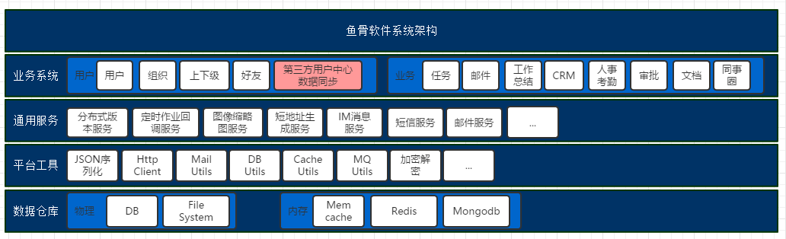
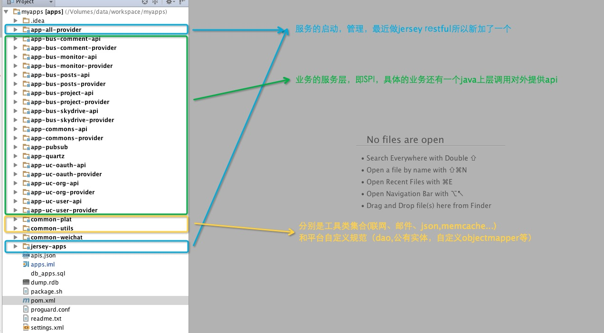
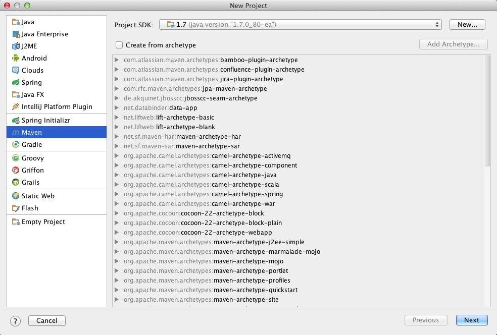
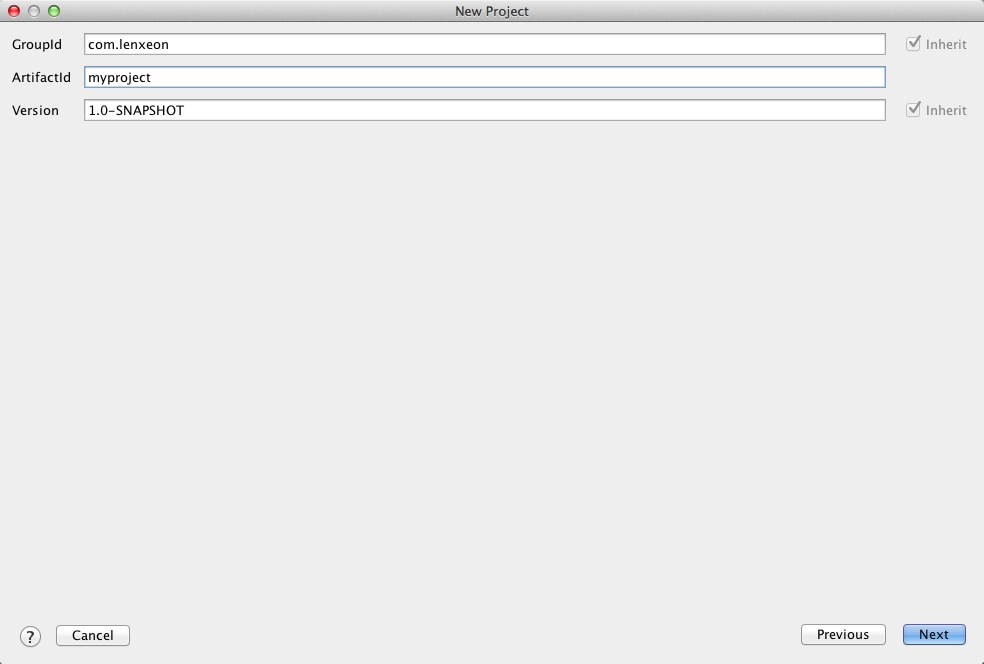
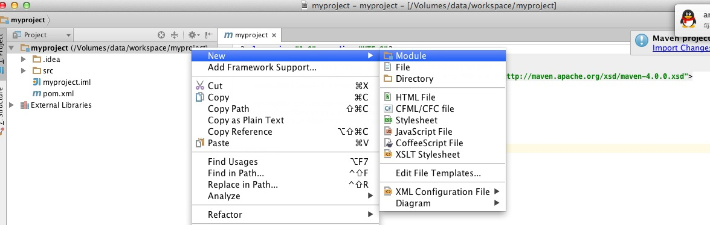
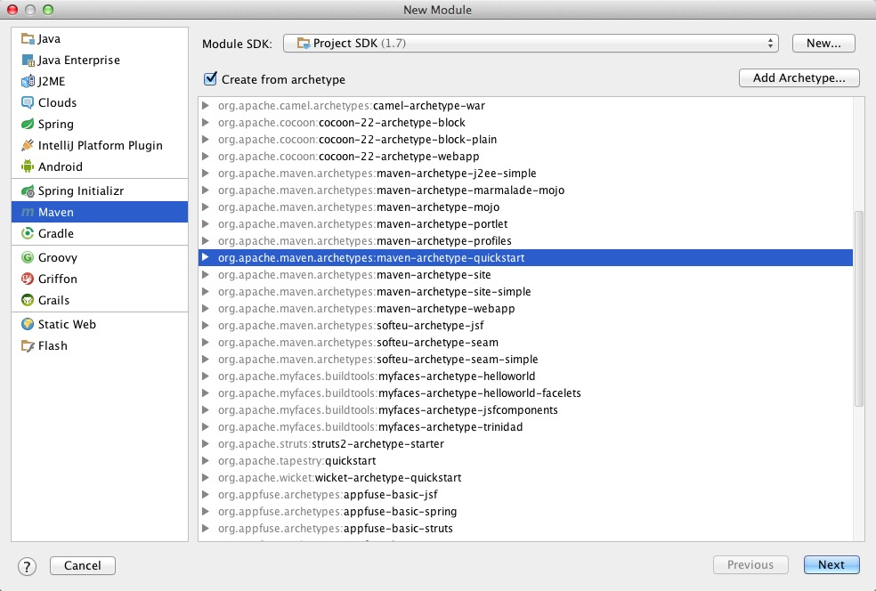
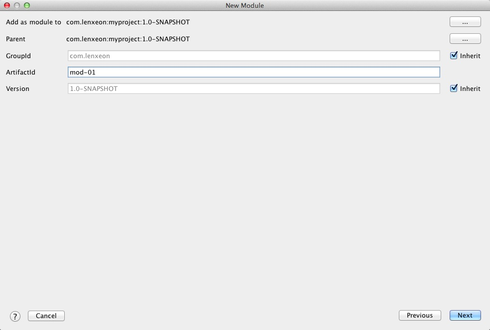
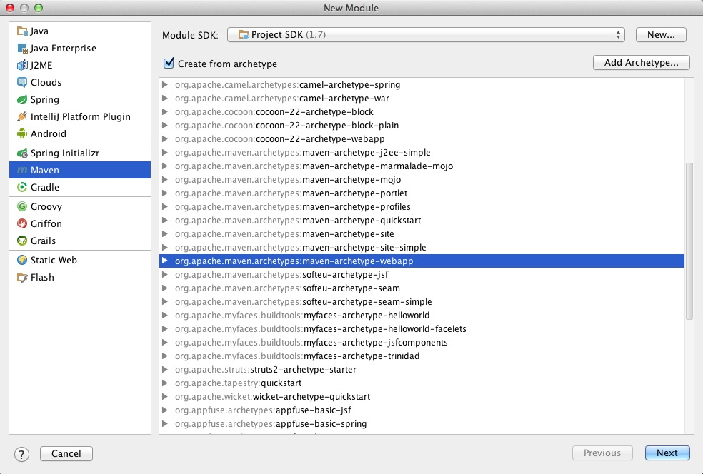
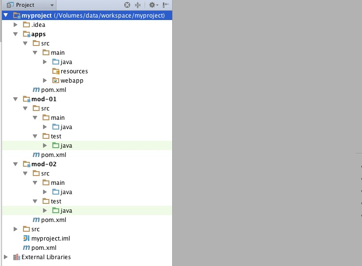
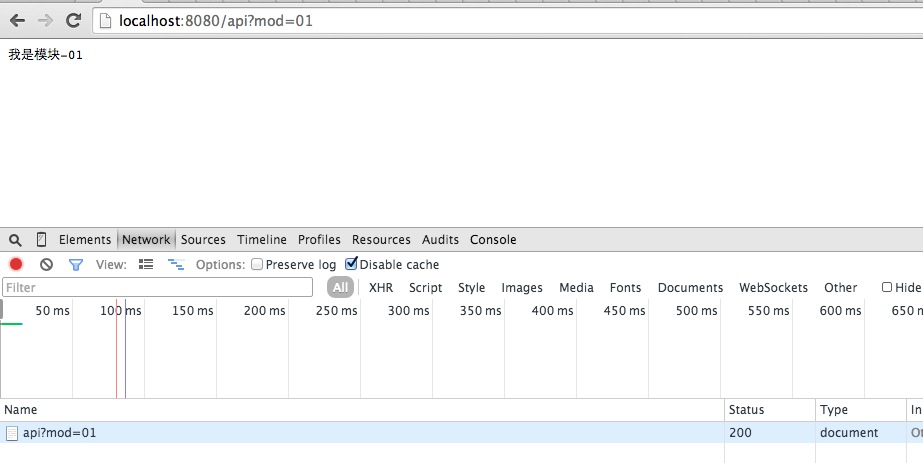

#mvn实现项目模块化管理方案

## 如果你有这样一个项目，你可能需要mvn实现项目模块化管理方案
1. 如果您有一个项目是一个长久的开发计划
1. 有至少中等应用的规模
1. 需要持续集成开发
1. 今后可能需要不同的团队或者人来负责不同的模块的代码
1. 希望有一个清晰的结构，而不是让所有程序员面对庞大的源码目录
1. 你不希望每一个开发人员都拿到所有的代码
1. 不希望每一次升级都需要漫长的编译等待过程
1. 不希望担心每天程序员会不会改错代码，会不会花很长时间去解决无尽的代码冲突

##先给两张图，看看鱼骨目前的模块化管理

* 整体想法


* 项目中的模块化


##如何建出上面的项目

先建一个maven的主项目





添加两个模块，注意打勾和选择的类型






添加一个web的模块，一会儿这个模块要依赖上面两个模块工作


全部建完后的样子，同时可以把最外层的src目录给删除了，用不着



##各个模块的pom如何配置
我们先来假设一下场景：
1. 有一些公共的依赖，比如：commons-lang两个模块都需要依赖
1. mod-02对mod-01有依赖
1. apps模块需要同时依赖mod-01,mod-02两个模块

总的那个pom，添加commons-lang
```xml
<?xml version="1.0" encoding="UTF-8"?>
<project xmlns="http://maven.apache.org/POM/4.0.0"
         xmlns:xsi="http://www.w3.org/2001/XMLSchema-instance"
         xsi:schemaLocation="http://maven.apache.org/POM/4.0.0 http://maven.apache.org/xsd/maven-4.0.0.xsd">
    <modelVersion>4.0.0</modelVersion>

    <groupId>com.lenxeon</groupId>
    <artifactId>myproject</artifactId>
    <packaging>pom</packaging>
    <version>1.0-SNAPSHOT</version>
    <modules>
        <module>mod-01</module>
        <module>mod-02</module>
        <module>apps</module>
    </modules>

    <dependencies>
        <dependency>
            <groupId>commons-lang</groupId>
            <artifactId>commons-lang</artifactId>
            <version>2.6</version>
        </dependency>
    </dependencies>


</project>
```


mod-02的pom，添加mod-01的依赖
```xml
<project xmlns="http://maven.apache.org/POM/4.0.0" xmlns:xsi="http://www.w3.org/2001/XMLSchema-instance"
         xsi:schemaLocation="http://maven.apache.org/POM/4.0.0 http://maven.apache.org/xsd/maven-4.0.0.xsd">
    <parent>
        <artifactId>myproject</artifactId>
        <groupId>com.lenxeon</groupId>
        <version>1.0-SNAPSHOT</version>
    </parent>
    <modelVersion>4.0.0</modelVersion>

    <artifactId>mod-02</artifactId>
    <packaging>jar</packaging>

    <name>mod-02</name>
    <url>http://maven.apache.org</url>

    <properties>
        <project.build.sourceEncoding>UTF-8</project.build.sourceEncoding>
    </properties>

    <dependencies>
        <dependency>
            <groupId>junit</groupId>
            <artifactId>junit</artifactId>
            <version>3.8.1</version>
            <scope>test</scope>
        </dependency>

        <dependency>
            <groupId>com.lenxeon</groupId>
            <artifactId>mod-01</artifactId>
            <version>1.0-SNAPSHOT</version>
        </dependency>

    </dependencies>
</project>
```


apps的pom，添加mod-01,mod-02的依赖
```xml
<project xmlns="http://maven.apache.org/POM/4.0.0" xmlns:xsi="http://www.w3.org/2001/XMLSchema-instance"
         xsi:schemaLocation="http://maven.apache.org/POM/4.0.0 http://maven.apache.org/xsd/maven-4.0.0.xsd">
    <parent>
        <artifactId>myproject</artifactId>
        <groupId>com.lenxeon</groupId>
        <version>1.0-SNAPSHOT</version>
    </parent>
    <modelVersion>4.0.0</modelVersion>

    <artifactId>mod-02</artifactId>
    <packaging>jar</packaging>

    <name>mod-02</name>
    <url>http://maven.apache.org</url>

    <properties>
        <project.build.sourceEncoding>UTF-8</project.build.sourceEncoding>
    </properties>

    <dependencies>
        <dependency>
            <groupId>junit</groupId>
            <artifactId>junit</artifactId>
            <version>3.8.1</version>
            <scope>test</scope>
        </dependency>

        <dependency>
            <groupId>com.lenxeon</groupId>
            <artifactId>mod-01</artifactId>
            <version>1.0-SNAPSHOT</version>
        </dependency>

        <dependency>
            <groupId>com.lenxeon</groupId>
            <artifactId>mod-02</artifactId>
            <version>1.0-SNAPSHOT</version>
        </dependency>

    </dependencies>
</project>
```


##各个模块中的关键代码

mod-01的业务逻辑
```java
package com.lenxeon;


public class Logic1 {
    public String say() {
        return "我是模块-01";
    }
}

```


mod-02的业务逻辑
```java
package com.lenxeon;


public class Logic2 {
    public String say() {
        Logic1 loc1 = new Logic1();
        return "我是模块-02，正调用" + loc1.say();
    }
}


```


apps 中的调度
```java
package com.lenxeon;

import javax.servlet.ServletException;
import javax.servlet.annotation.WebServlet;
import javax.servlet.http.HttpServlet;
import javax.servlet.http.HttpServletRequest;
import javax.servlet.http.HttpServletResponse;
import java.io.IOException;

@WebServlet("/api")
public class MyServlet extends HttpServlet {

    @Override
    protected void doGet(HttpServletRequest req, HttpServletResponse resp) throws ServletException, IOException {
        String mod = req.getParameter("mod");
        String result = "请选择模块";
        if ("01".equals(mod)) {
            Logic1 logic1 = new Logic1();
            result = logic1.say();
        } else if ("02".equals(mod)) {
            Logic2 logic2 = new Logic2();
            result = logic2.say();
        }
        resp.setCharacterEncoding("utf-8");
        resp.getWriter().write(result);
        resp.getWriter().flush();
        resp.getWriter().close();
    }
}
```


##请求效果




##源码地址
https://github.com/lenxeon/lab/tree/master/mvn-project
