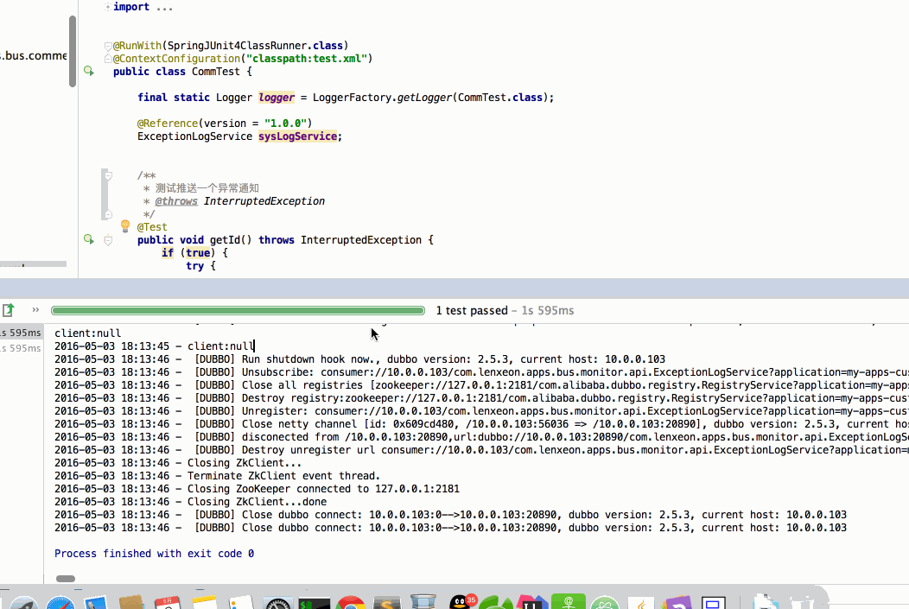
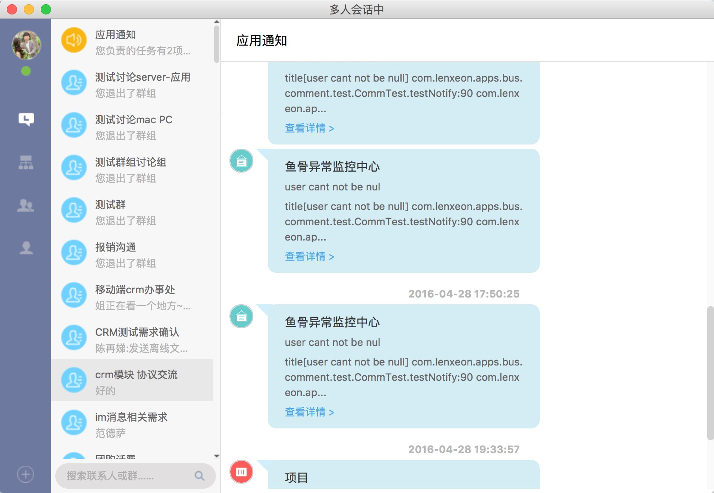
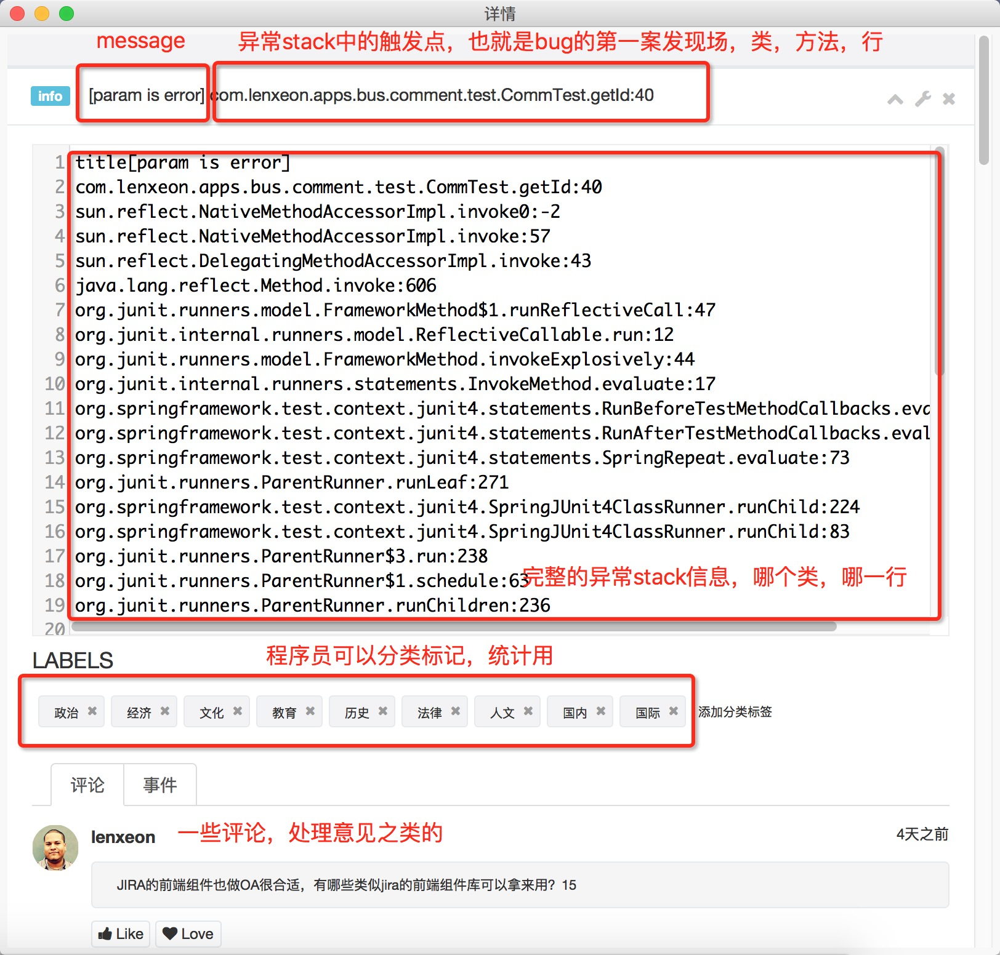

#构建鱼骨的服务器异常监控体系（未完）

## 场景及问题
> 作为java服务器开发，服务器上的异常处理的响应速度直接关系到服务的质量评分，所以我们向自己提出以下几个需求。

1. 日志只是最低级别的要求，处理好相应的日志
2. 及时性，第一时间发现异常，由于大家还有许多的工作需要处理，不可能时刻关注着服务器的日志，因此就需要一个即时的异常通知：邮件，短信 or im
3. 历史记录查询，统计分析：所有的日志记录，处理情况跟踪，分析统计等。

## 先来看两张效果图

* 动态演示

* 订阅程序员收到的异常信息

* 点击异常信息后在鱼骨中的展现

