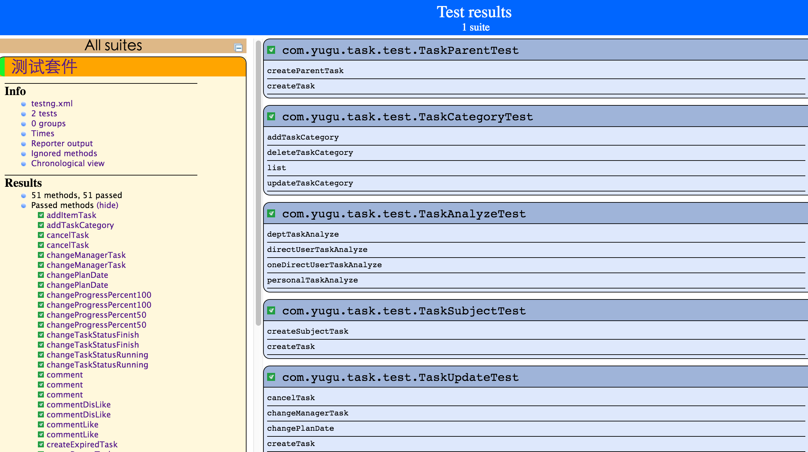
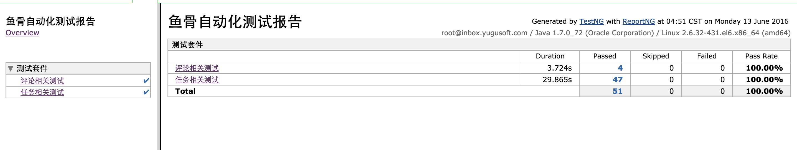
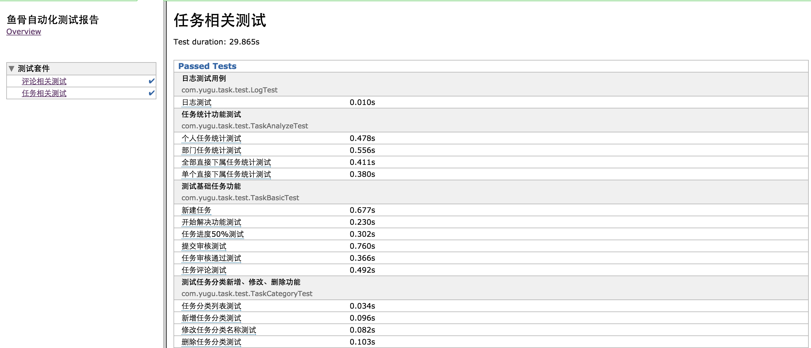
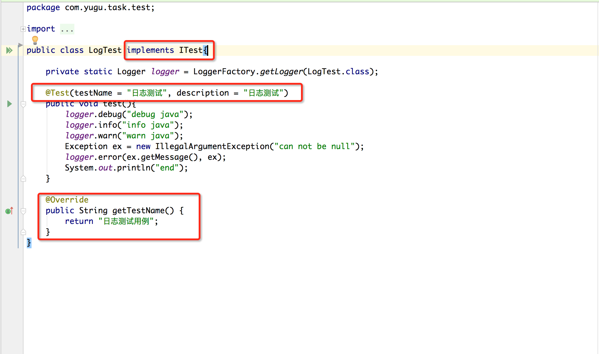

# 自定义report-ng测试报告

## 先上结果 ##
1. testng 的默认报告

1. report-ng 整体测试报告

1. report-ng 某个测试过程的详情

## reportng 相关的源码 ##
 git https://github.com/lenxeon/reportng, 主要修改了测试结果排序，Interceptor获取testName注解，
 修改为maven项目，修改了模板及默认样式
## maven-surefire-plugin 中的配置 ##

``` xml
<plugin>
    <groupId>org.apache.maven.plugins</groupId>
    <artifactId>maven-surefire-plugin</artifactId>
    <version>2.19</version>
    <configuration>
        <argLine>-Xmx1024m -XX:PermSize=1024m -XX:MaxPermSize=1024m</argLine>
        <!--<additionalClasspathElements>-->
        <!--<additionalClasspathElement>-->
        <!--${basedir}/target/test-classes-->
        <!--</additionalClasspathElement>-->
        <!--</additionalClasspathElements>-->
        <suiteXmlFiles>
            <suiteXmlFile>src/test/resources/testng.xml</suiteXmlFile>
        </suiteXmlFiles>
        <includes>
            <include>**/*Test.java</include>
        </includes>
        <!--跳过测试-->
        <skipTests>false</skipTests>
        <!--<excludes>-->
        <!--<exclude>**/TestConstants.java</exclude>-->
        <!--</excludes>-->
        <!--<forkMode>pertest</forkMode>-->
        <!--多线程-->
        <parallel>classes</parallel>
        <threadCount>10</threadCount>
        <testFailureIgnore>true</testFailureIgnore>
        <properties>
            <property>
                <name>usedefaultlisteners</name>
                <value>true</value>
            </property>
            <!--<property>-->
            <!--<name>listener</name>-->
            <!--<value>org.uncommons.reportng.</value>-->
            <!--</property>-->
        </properties>
    </configuration>
</plugin>
```

## testng xml配置 ##

* testng.xml

```xml
<?xml version="1.0" encoding="UTF-8"?>
<!DOCTYPE suite SYSTEM "http://testng.org/testng-1.0.dtd" >
<?xml version="1.0" encoding="UTF-8"?>
<!DOCTYPE suite SYSTEM "http://testng.org/testng-1.0.dtd" >
<suite name="测试套件">
    <test name="评论相关测试" parallel="classes">
        <packages>
            <package name="com.yugu.task.comment">
            </package>
        </packages>
    </test>
    <test name="任务相关测试">
        <packages>
            <package name="com.yugu.task.test">
            </package>
        </packages>
    </test>
    <parameter name="useDefaultListeners" value="false"/>
    <listeners>
        <listener class-name="org.uncommons.reportng.HTMLReporter"/>
        <listener class-name="org.uncommons.reportng.JUnitXMLReporter"/>
        <!--这里面主要可以配置一些全局变量,参考:http://reportng.uncommons.org/上的说明-->
        <listener class-name="com.yugu.task.lisenter.TestListener"/>
        <!--下面三个是reportng中自定义代码,其实主要有用的是Interceptor,实现了获取中文注解,其它都没有实现,
        可以参考:https://github.com/lenxeon/reportng-->
        <listener class-name="org.uncommons.reportng.support.listener.CustomSuiteListener"/>
        <listener class-name="org.uncommons.reportng.support.listener.CustomResultListener"/>
        <listener class-name="org.uncommons.reportng.support.listener.Interceptor"/>
    </listeners>
</suite>
```

## 单元测试试例 ##
* 需要实现ITest接口，在getTestName中返回这个测试实例的名称
* 在每一个Test方法上用 @Test(testName = "日志测试", description = "日志测试")


