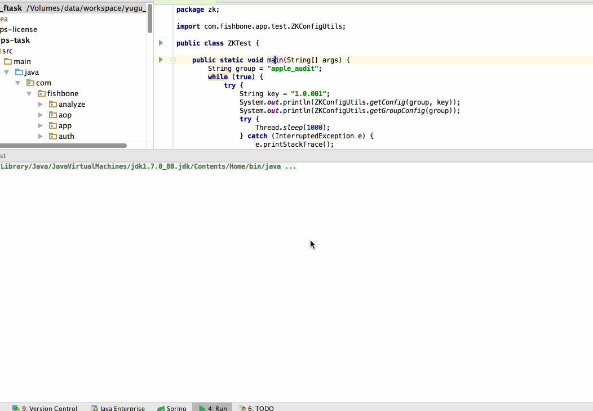
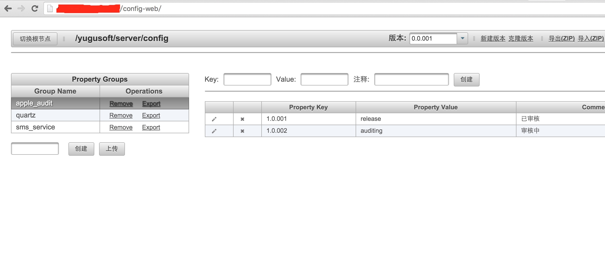

#使用zookeeper+config-toolkit管理系统中的配置文件

## 场景及预期
1. 系统中有不少场景需要用到配置文件，比如：多国语言，运营参数，系统参数等等
1. 期望：修改后能较快的更新，代价不要太大，打包，部署，重启，清缓存都不要有，要实时，要轻量，易用。

## 偶然的机会了解到了config-toolkit
> 基于zookeeper，修改后集群自动同步，监听会实时将变化更新到系统中，采用map做为数据缓存，每次在Map中拿配置，界面也还不错
``` properties

* 动画演示


* 管理界面



``` 工具类
package com.fishbone.app.test;

import com.dangdang.config.service.ConfigGroup;
import com.dangdang.config.service.zookeeper.ZookeeperConfigGroup;
import com.dangdang.config.service.zookeeper.ZookeeperConfigProfile;
import com.lenxeon.utils.basic.Config;
import org.apache.commons.collections.map.HashedMap;
import org.apache.commons.lang.StringUtils;
import org.slf4j.Logger;
import org.slf4j.LoggerFactory;

import java.util.Map;


public class ZKConfigUtils {

    final static Logger logger = LoggerFactory.getLogger(ZKConfigUtils.class);

    final static Map<String, ConfigGroup> groups = new HashedMap();

    private static ConfigGroup getGroup(String group) {
        ConfigGroup zkConfigGroup = groups.get(group);
        if (zkConfigGroup == null) {
            ZookeeperConfigProfile configProfile = new ZookeeperConfigProfile(Config.getLocalProperty("zk.address"), "/yugusoft/server/config", "0.0.001");
            zkConfigGroup = new ZookeeperConfigGroup(configProfile, group);
            groups.put(group, zkConfigGroup);
        }
        return zkConfigGroup;
    }

    public static String getConfig(String group, String key) {
        long start = System.currentTimeMillis();
        ConfigGroup zkConfigGroup = getGroup(group);
        String result = StringUtils.defaultString(zkConfigGroup.get(key));
        long end = System.currentTimeMillis();
        logger.info("ZKConfigUtils.getConfig:cost[{}]ms", (end - start));
        return result;
    }

    public static Map getGroupConfig(String group) {
        long start = System.currentTimeMillis();
        ConfigGroup zkConfigGroup = getGroup(group);
        long end = System.currentTimeMillis();
        logger.info("ZKConfigUtils.getConfig:cost[{}]ms", (end - start));
        return zkConfigGroup;
    }

}

```

```测试
package zk;

import com.fishbone.app.test.ZKConfigUtils;

public class ZKTest {

    public static void main(String[] args) {
        String group = "apple_audit";
        while (true) {
            try {
                String key = "1.0.001";
                System.out.println(ZKConfigUtils.getConfig(group, key));
                System.out.println(ZKConfigUtils.getGroupConfig(group));
                try {
                    Thread.sleep(1000);
                } catch (InterruptedException e) {
                    e.printStackTrace();
                }
            } catch (Exception ex) {
                ex.printStackTrace();
            }
        }
    }

}

```
