> 现在的程序员比较偏爱mac，除了苹果自身的高颜质和高质量外，很大程度上还是因为 mac 的系统要比 windows 好用。当然前提是能找到和自己工作相对应的软件，像 plsql、powerdesigner 这样的软件目前还是没有较好的替代方案。我日常的开发工作主要是 java 和 web 两个方向。java 用于开发协议和微服务，涉及到 tomcat、nginx、各种依赖服务，如：redis、memcached、mongodb、rmq、zookeeper等。web 方向涉及到 webpack、vue、fis3、extjs、d3js 等技术。结合我自己的习惯，给大家介绍一些使用经验，主要目的：保持电脑环境的纯净和提升工作效率。


<center> 我电脑目前的磁盘使用情况</center >

> 如果你也希望自己的电脑一直都操持纯净，不想哪天被提示没有存储空间或者莫名其妙的发现没装几个软件，磁盘的占用率却已经很高，即使卸载软件也起不了多少用，可以花几分钟时间了解下以下的内容，应该能有所收获。
PS：我的电脑硬盘分 os 和 data 两个区，下文中提到的 homebrew，docker，maven，node 都属于资源管理类型的软件，通常会占用较大的存储空间，比如docker的镜像存储目录，maven的本地库。因此建议全部采用软链的方式，将这些资源统一存储到data分区中，以控制os分区的占用空间。

1. 使用time machine 苹果自带的备份工具备份电脑

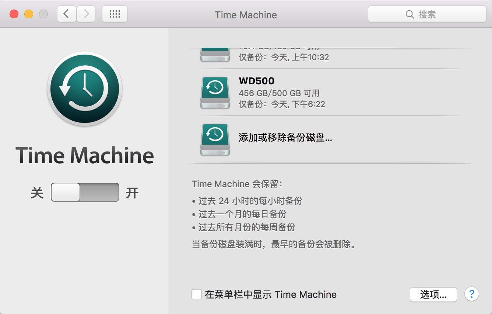
<center> time machine 完成首次备份</center >

> time machine是苹果自带的备份工具，可以随时备份和还原到指定的时刻，像我这样爱折腾又有洁癖（仅针对电子产品^-^）的人，对软件安装后的垃圾问题向来零容忍，所以通常我会在装好系统的时候立刻备份一次，然后开始安装主要的工作环境，完成后再备份一次。如果中途出了任何问题立刻恢复重来。这两次备份做好后以后就关闭time machine 不再备份了,我可不想因为备份磁盘不足将这两个重要的成果给自动删除了。今后工作过程中产生的资料、代码将统一交给git存储，这是一个良好的工作习惯。


2. 使用homebrew 管理你的软件

```/usr/bin/ruby -e "$(curl -fsSL https://raw.githubusercontent.com/Homebrew/install/master/install)"
```

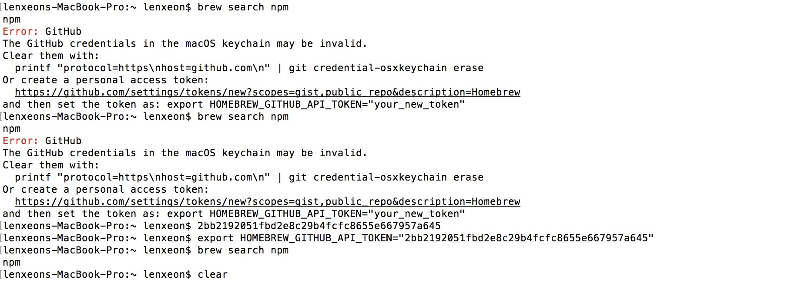
<center> homebrew 安装提示 </center >


> homebrew 的安装过程非常简单，网上也有很多的教程可供参考，图中的提示可以复制链接到网页，在 github 上生成一个 token 并按上面的提示写入到环境变量中就可以开始使用了。一句话总结：能用 homebrew 安装的软件一概用它安装。
  brew search [TEXT|/REGEX/] 搜索线上的软件
  brew install FORMULA...  安装软件
  brew update 更新 homebrew 自己
  brew upgrade [FORMULA...] 更新软件
  brew uninstall FORMULA... 删除软件
  brew list [FORMULA...] 查看本机安装的软件


3. 使用 iterm2 替换苹果默认的终端


> iterm2 是很多人都推荐的工具，可以水平或者纵向分割窗口，配合 zsh、 oh-my-zsh、 solarized 配色、Powerline 字体、coreutils 就可以达到上图中的炫酷效果。另外任何你之前使用过的命令还可以通过上下键翻出来，你也可以先输入几个开始的字母后再按上下键查找，大大的提高了工作效率。它的配置过程稍复杂一些，也可以参考我git上的文章 https://github.com/lenxeon/notes/tree/master/ 配置。另外做为一个服务器开发者，一定要多掌握一些常用 shell 命令，像 grep awk tail seed curl find 这些命令能够帮助我们快速地分析日志，做起事来事半功倍。

4. 使用docker 搭建各种服务环境zk、数据库、rmq等

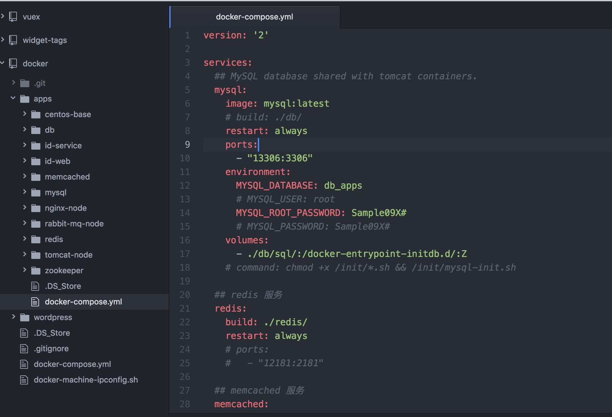
<center> 注册个国内的镜像加速 </center >


<center> 设置使用国内镜像加速 </center >


<center> kitematic 管理器 </center >


<center> docker-compose服务编排 </center >

> docker是近年来非常热门的技术，容器化，弹性云计算这些耳熟能详的词语都跟他有关。使用 docker-compose 来编排应用，可以真正做到一键安装，大大的降低了目标客户安装软件的难度。目前对我来说最大的好处是实现了母机环境的纯净管理。有了 docker 所有的配置尝试、变量修改、软件安装全部都在容器内进行，这些修改都将随着容器的删除而彻底删除，再也不用担心母机的软件越装越多，硬盘占用越来越大，软件删除后的顽固垃圾无法真正彻底的清理干净，环境变量杂乱、冲突等问题了。 它主要的功能有：
将应用程序便携式部署成单一对象，而不是进程沙箱；
以应用程序为中心，而不是以机器/服务器为中心；
支持容器自动化构建；
内置版本控制功能；
可重复使用的组件；
共享容器的公共注册中心；
借助已发布的API，建立日益庞大的工具生态系统。我们理想的应用方式是：在docker的基础上结合 gitlab，jenkins 和我们鱼骨软件的 im 服务构建一套持续集成的开发管理模式。当成员提交代码到 git 后，git 会通知到 jenkins 触发相应的自动化测试，测试完成后会将测试报告发布给鱼骨的订阅群组，如果遇到测试不通过的情况则由相关的开发者查明原因、修正并重新提交代码。这样可以极大程度的保证代码的质量，减少测试人员的重复劳动，提升工作效率

> PS 因为docker默认的镜像库在国外，导致拉取镜像的时候速度超慢，因此我们需要注册一个国内的镜像库。

5. 使用Dash管理你的文档

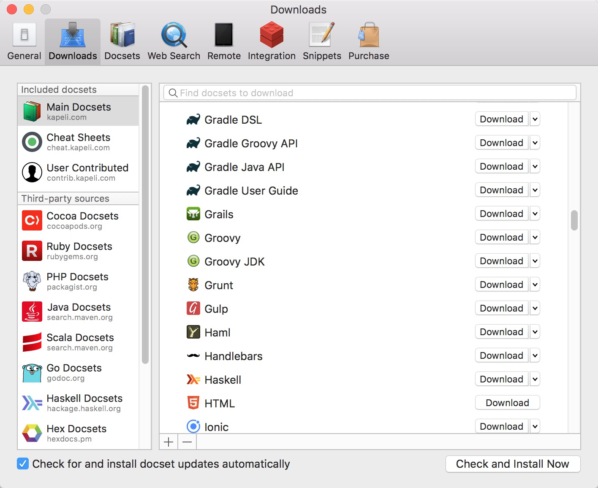
<center> dash 提供了大量的文档供下载 </center >

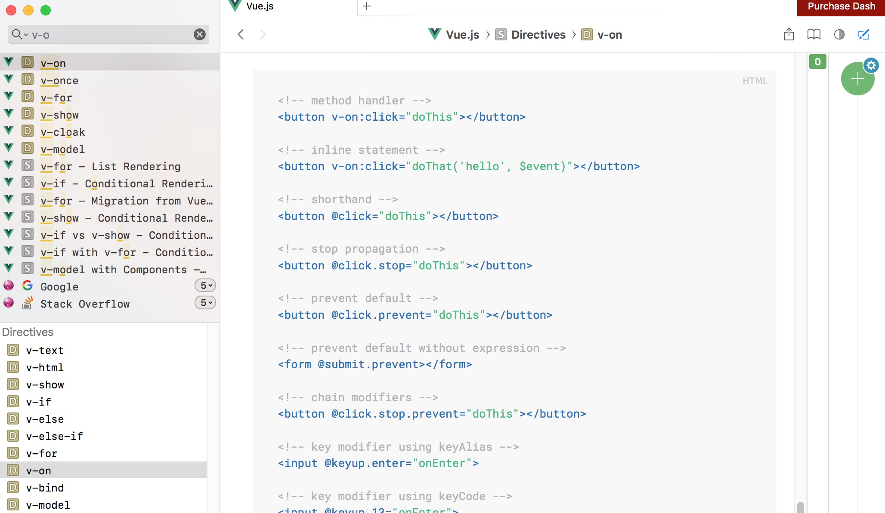
<center> 使用dash查找vue的api </center >

>dash 是mac上最好最全的文档管理工具，本身提供了大量的文档供下载，几乎各类语言的各个版本都可以在这里找到相应的文档，而且使用起来也非常简单方便。

6. 使用Xmind管理你的思路

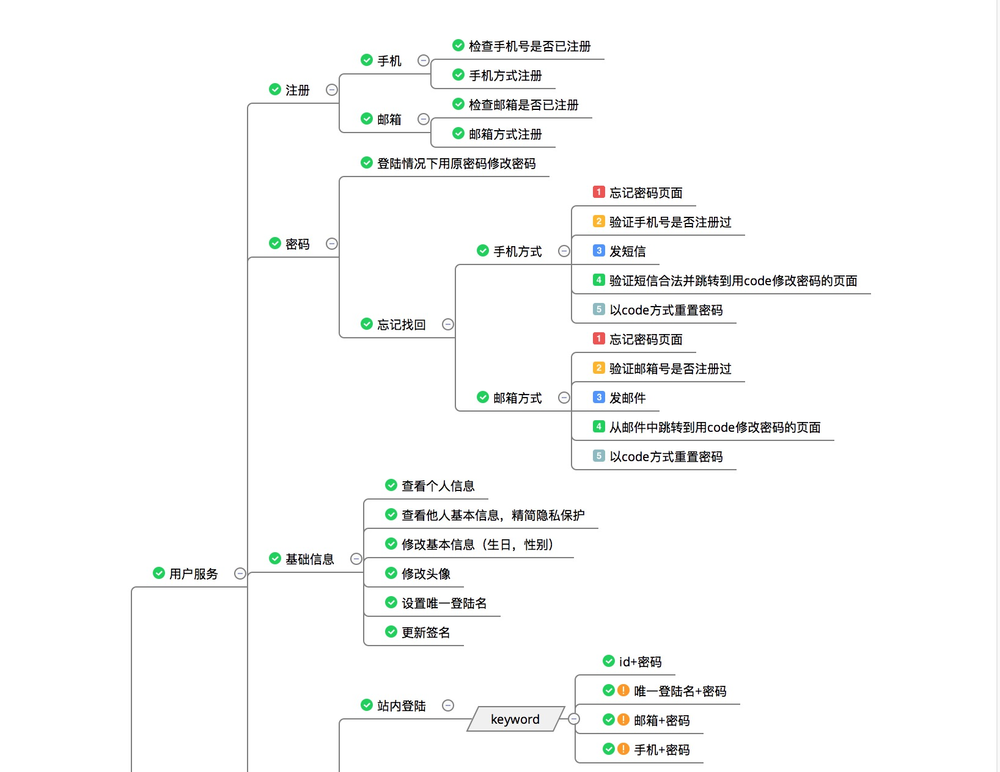
<center> 用户服务相关的部分功能 </center >

>我们在做服务开发的时候，经常需要思考这么几个问题：如何拆分服务，目前已经提供了哪些服务，还有哪些可以完善的服务。脑图工具可以很好的帮助我解决这些问题，脑图节点就代表着如何拆分，已经提供服务的用已完成标记，认为有问题可以改善的服务可以用感叹号标记，还未做的服务用未启动标记。脑图工具有很多可选，像业内知名的有 xmind, mindmanager 。随着云概念的火热，现在也有很多的在线脑图工具可选择，包括我们的鱼骨软件也都有提供在线脑图这样的功能。

7. 使用 IntelliJ IDEA 开发 java


<center> idea 的开发界面 </center >

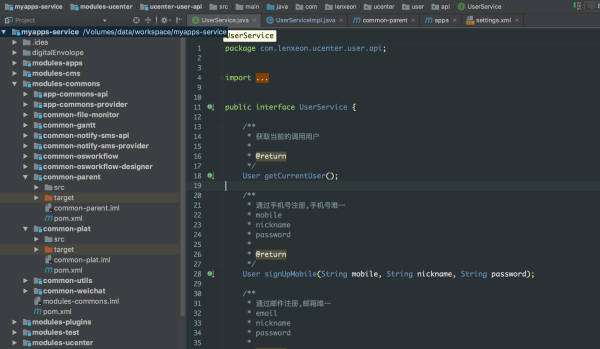
<center> idea 配色后的的开发界面 </center >

>提到idea不得不说说jetbrains这家公司，真心的很佩服他们。idea、 webStorm、 phpStorm 每一款编辑器都倍受好评。我使用idea大概 5 年了，除了头两年还有用 eclipse 外一直在用它，究竟好在哪里真有点说不上来，但用过以后你心里就是会觉得它好，有点像苹果的产品，爱在不言中。
PS: http://color-themes.com/ 这里有很多的配色方案，下载后导入即可

8. sublime text / atom web开发的神器


<center> sublime text 的开发界面 </center >

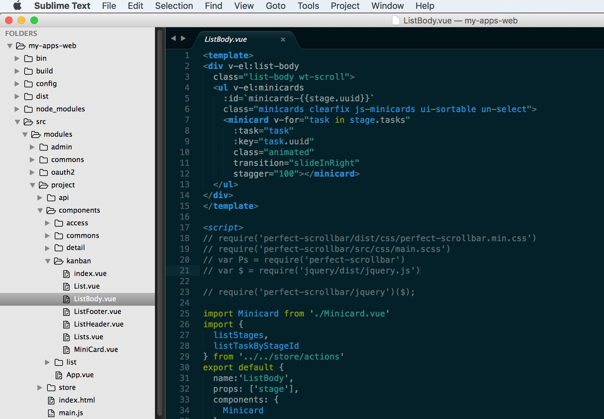
<center> atom 的开发界面   </center >

>两个非常有名的文本编辑器，从性能上讲 sublime 更强，加载一个较大的文件就看出来。atom毕竟是用JS编写的产品，所以这点也说的过去了。之所以两个都装是因为我经常切换项目做一些参考，而且两个产品还是有一些不同的特点，小文件编写我更常用 atom。另外单就 web 开发而言还是尽量抛弃那些比较笨重的开发工具吧，比如当年的dreamware。用这两个编辑器能帮助你快速掌握前端那些标签，样式，函数，一点也不比用 dreamware 慢，如果说还有比它更适合前端开发的编辑器那估计就只能是 webstorm 了。

9. 使用jenv/nvm 管理java和node的多版本环境


<center> jenv 切换不同版本的jdk演示 </center >

>在开发的过程中，偶尔会遇到需要使用不同版本的 jdk，nodejs 的场景。这两个命令可以方便的帮助我们实现不同版本的切换功能，想用哪个版本就用哪个版本，再也不用手忙脚乱的去修改环境配置了。

10. 使用 tower 管理你的 git 项目


<center> 新版的tower支持很多种账户类型 </center >

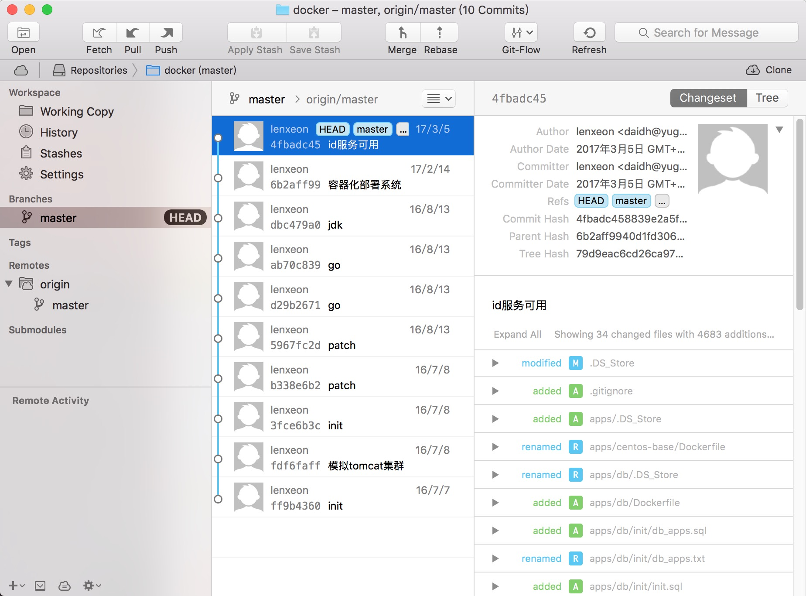
<center> 项目代码管理界面 </center >

>tower 提供了git 的 GUI 管理界面，极大的降低了 git 的入门难度。是 git 入门者、命令恐惧者的福音。

11. 使用 omnigraffle 画图

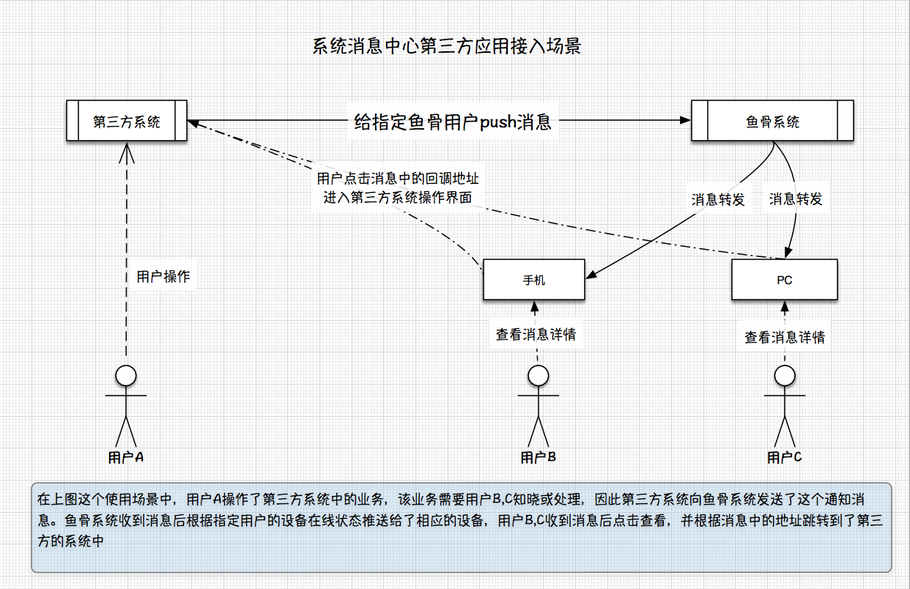
<center> omnigraffle 画的应用场景示意图 </center >

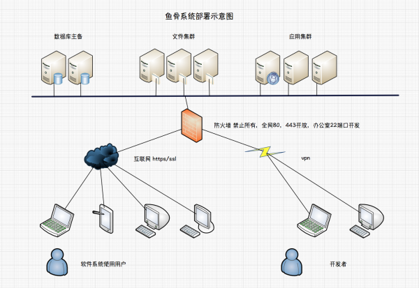
<center> omnigraffle 画的系统部署示意图 </center >

>又是一家需要膜拜的软件公司，每一款产品都很出名 omnigraffle 、omniplan、 OmniOutliner、omnifocus。我喜欢用它的 omnigraffle 画图工具。软件本身并不大，提供一些基础的矢量素材供使用，同时也可以自己从网上下载素材导入使用。

12. 使用 鱼骨软件 来管理团队日常工作

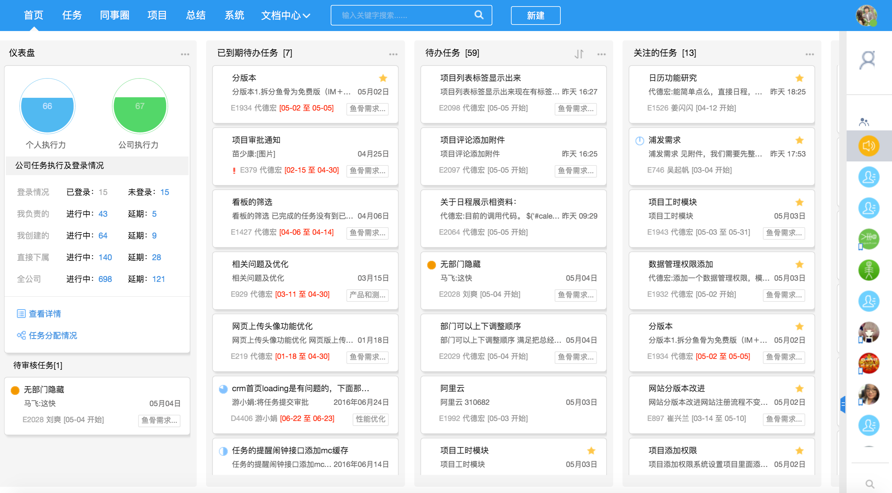
<center> 首页面板 </center >


<center> 项目管理 </center >

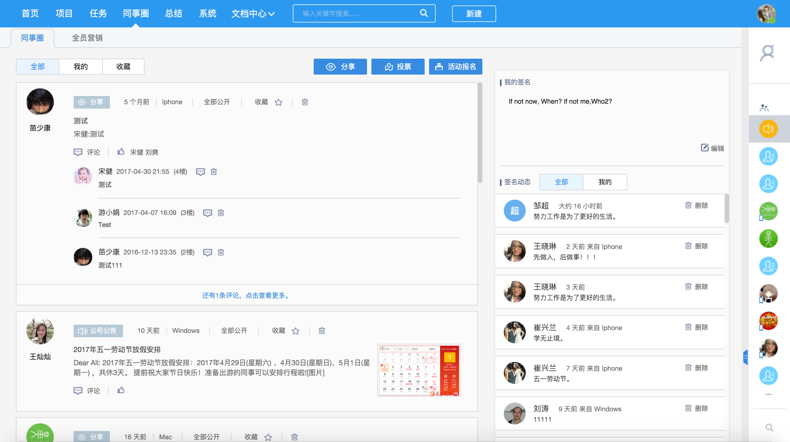
<center> 同事们的分享及活动公告 </center >

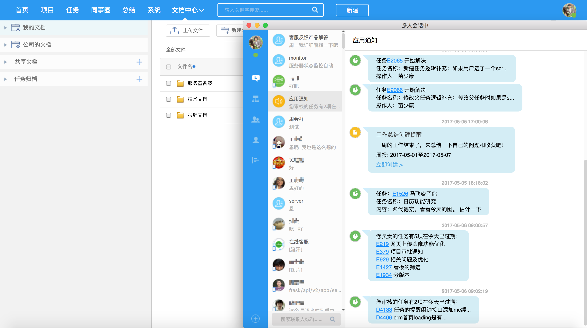
<center> 应用消息通知中心 </center >


<center> 部门群中的日常沟通 </center >

>这是我们自己开发的办公协作软件: http://www.yugusoft.com/p/ ，主要的功能包括：项目管理，任务，文档，同事圈，IM。目前我们内部的管理工作已经全在这个软件中进行。每周一在公司的周会中定义下本周的开发计划，再回到部门中召开一个十分钟左右的站立会议，给部门成员传达本周的工作重点，会后拆解成相应的任务落实到具体的负责人进行开发，任务需求相关的原型图和设计稿由产品和设计的同事以附件的方式提交到任务中。中途有疑问的地方可以在评论或者Im中进行沟通，如果沟通不顺畅则会组织一个小范围的面对面讨论，达成一致意见后再次将新的共识更新到任务评论或附件中。

13. 结语

>除了上面这些软件外还有一些其它的软件，像：chrome，navicat，gitbook 等等就不再一一截图展示了。以上这些已经满足了我日常的使用需求，而且涉及到软件安装，环境搭建的问题已都有了较好的解决办法，主要还是归功于 homebrew 和 docker 两款软件。如果您喜欢这篇文章请帮我点个赞～～。
＝＝＝＝＝＝＝＝＝＝＝＝＝＝＝＝＝＝＝＝＝＝＝＝＝＝＝＝
看到大家争论分区问题，我觉得要坚持分区，这是一种对待系统和数据的态度。实际上所谓的空间利用率这点我觉得是占不住脚的，比如最小128G的硬盘并不会因为分两个区就少放东西了，实际上本身我们也放不满整个硬盘，比如60G的系统，60G的数据，我们会有60G的数据需要放么，感觉是不太可能的，除非是资料收集者，比如电影、视频之类的。所以我的数据盘里一般只有代码，文档，图片，而它们一般也就在10-30G左右。分了区会在find的设备里有一个入口，结构也更清晰。而且这个和windws其实是一样的，为啥windows里面我们会分成：系统，游戏，娱乐等等，到了mac上分区就不行了呢？
