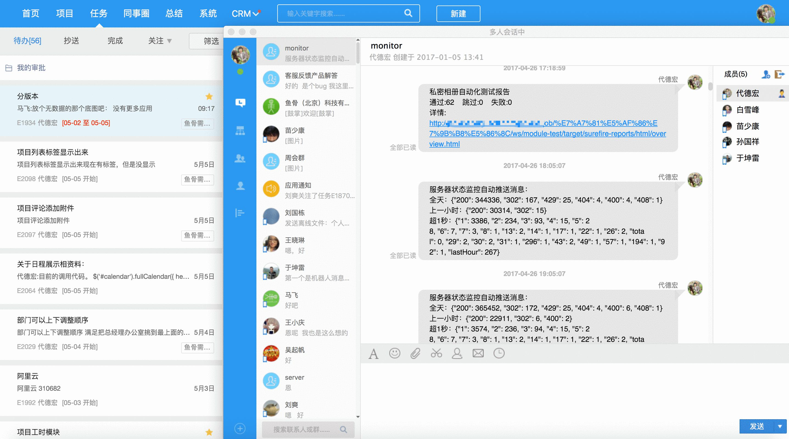
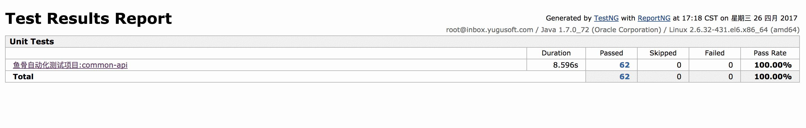
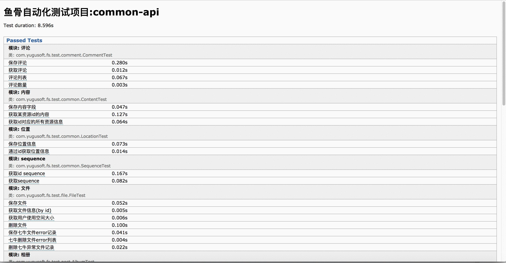
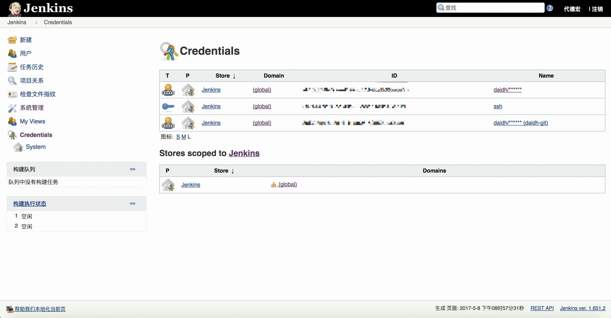
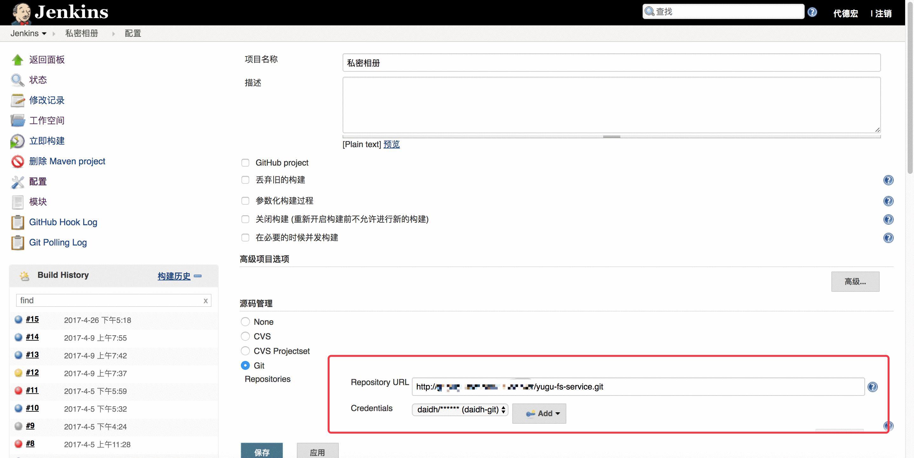
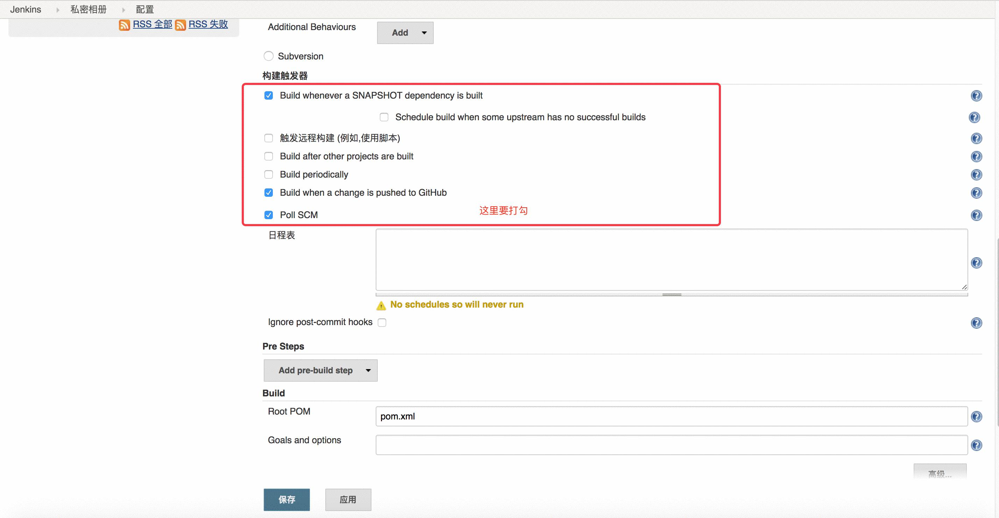
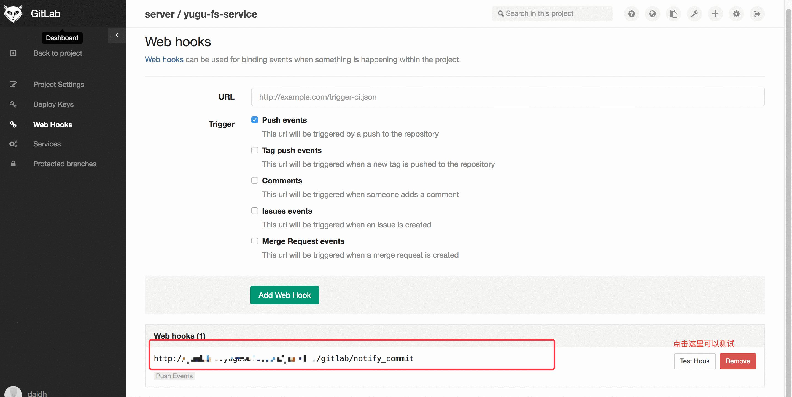

> 为了提高开发代码的质量我们现在有一个简单的应用场景，当开发人员每一次提交代码后，git-lab会通过webhook的方式向jenkins触发一次测试任务，jenkins在测试完成后会将效果自动送到我们IM系统中。开发人员收到测试结果后可以通过地址查看测试结果，如果有问题会立刻进入BUG修复过程。


### 先看一下结果


测试完成后自动给我们的IM发送测试结果


开发人员点击链接可以查看到测试报告


更详细的测试结果

### Jenkins的配置
> jenkins中的配置分为三步：1 是要在系统里添加一个gitlab的账户和密码，这样项目里才能下载到代码。2 新建项目，配置源码管理为git的方式，选刚才添加的账户， 3 勾选构建触发器 具体参考下面的三张图


配置账户


添加项目配置源码


添加项目配置构建触发器


### git-lab中的配置
> git-lab 中的配置比较简单，主要就是配置一个webhook,


在项目中配置webhook


### 还差最后一步，我们还要实现将测试结果推送到自己的IM服务器，大家可以换成自己的服务，比如微信的就是一个不错的选择

> 我这里是直接在report-ng的源码里改的，其实可以引入jar，然后继承 org.testng.IReporter, 实现一个将消息推送到IM的实例。

```java
package org.uncommons.reportng;

import com.alibaba.fastjson.JSON;
import com.google.common.collect.ImmutableBiMap;
import okhttp3.*;
import org.testng.IReporter;
import org.testng.ISuite;
import org.testng.ISuiteResult;
import org.testng.xml.XmlSuite;

import java.io.IOException;
import java.util.Collection;
import java.util.LinkedHashMap;
import java.util.List;
import java.util.Map;


public class YuguIMReporter implements IReporter {

    private static final String reportHref = "http://xxx.xxx.com/jenkins/job/%E7%A7%81%E5%AF%86%E7%9B%B8%E5%86%8C/ws/module-test/target/surefire-reports/html/overview.html";

    private static final String REPORT_TITLE_ARG = "report.title";
    private static final String DEFAULT_REPORT_TITLE = "Test results";

    public static final MediaType jsonType
            = MediaType.parse("application/json");

    @Override
    public void generateReport(final List<XmlSuite> xmlSuites, final List<ISuite> suites, final String outputDirectory) {
        int passed = 0;
        int skipped = 0;
        int failed = 0;
        for (ISuite suite : suites) {
            Collection<ISuiteResult> irs = suite.getResults().values();
            for (ISuiteResult ir : irs) {
                passed += ir.getTestContext().getPassedTests().size();
                skipped += ir.getTestContext().getSkippedTests().size();
                failed += ir.getTestContext().getFailedTests().size();
            }
        }
        String title = System.getProperty(REPORT_TITLE_ARG, DEFAULT_REPORT_TITLE);
        StringBuffer text = new StringBuffer(title);
        text.append("\r\n").append("通过:" + passed + "\t跳过:" + skipped + "\t失败:" + failed);
        text.append("\r\n").append("详情:\r\n" + reportHref);

        System.out.println(text);
        // 这一段将消息推送到我们自己的IM服务器
        String href = "http://xxx.xxx.com/openapi/msg/send";
        Map message = new LinkedHashMap();
        message.put("sender", "xxxxxx");
        message.put("text", text);
        message.put("receiver", ImmutableBiMap.of("type", "group", "id", "xxxxxx"));
        message.put("msg_type", "text");

        FormBody.Builder builder = new FormBody.Builder();
        builder.add("comp_id", "DbazTRK72RF1Beiqxx6SSQ");
        builder.add("message", JSON.toJSONString(message));

        OkHttpClient client = new OkHttpClient();
        Request request = new Request.Builder()
                .url(href)
                .addHeader("Accept", "application/json; q=0.5")
                .post(builder.build())
                .build();


        Response response = null;
        try {
            response = client.newCall(request).execute();
            System.out.println(response.isSuccessful() + "\t" + response.body().string());
        } catch (IOException e) {
            e.printStackTrace();
        }
    }
}
```
> test-ng 中的配置，关键是注册了我们自己实现的监听器，这样当测试完成后就会触发这个监听器，就可以给我们的IM通信了
```xml
<?xml version="1.0" encoding="utf-8"?>
<!DOCTYPE suite SYSTEM "http://testng.org/testng-1.0.dtd">

<suite name="Unit Tests1111">
    <suite-files>
        <suite-file path="testng2.xml"></suite-file>
        <suite-file path="testng3.xml"></suite-file>
    </suite-files>
    <parameter name="useDefaultListeners" value="false"/>
    <listeners>
        <listener class-name="org.uncommons.reportng.HTMLReporter"/>
        <listener class-name="org.uncommons.reportng.YuguIMReporter"/>
        <listener class-name="org.uncommons.reportng.JUnitXMLReporter"/>
        <listener class-name="org.uncommons.reportng.support.listener.BaseHTMLReporter"/>
        <listener class-name="org.uncommons.reportng.support.listener.CustomSuiteListener"/>
        <listener class-name="org.uncommons.reportng.support.listener.CustomTestListener"/>
        <listener class-name="org.uncommons.reportng.support.listener.CustomResultListener"/>
        <listener class-name="org.uncommons.reportng.support.listener.Interceptor"/>
    </listeners>
</suite>
```

### 最后再总结一下这个过程

> 整个过程分为三步，jenkins中配置项目，可以从git-lab中拉取项目进行编译。 git-lab 中配置webhook 当有新的代码提交的时候触发jenkins进行测试
实现自己的测试报告推送接口，将测试结果推送到自己的IM服务中。致此一套初步的持续集成方案就实现了。整个过程没有额外增加程序员的工作任务，又能帮助程序员尽早的发现自己的代码问题，提高工作质量和效率。也是算是敏捷开发中的一部分。
